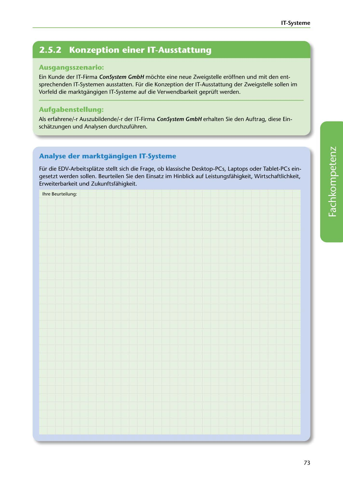

---
## Page 75
---

IT-Systerne

<!-- IMAGE: page-075-img-1.jpeg - TODO: Add description -->

**[VISUAL: CONSYSTEM GMBH SCENARIO HEADER]**
Header image for the ConSystem GmbH IT systems analysis for new branch office exercise.

## Ausgangsszenario:

Ein Kunde der IT-Firma ConSystem GmbH mochte eine neue Zweigstelle eroffnen und mit den ent- sprechenden IT-Systemen ausstatten. Für die Konzeption der IT-Ausstattung der Zweigstelle sollen im Vorfeld die marktgangigen IT-Systeme auf die Verwendbarkeit geprüft werden.

## Aufgabenstellung:

Als erfahrene/-r Auszubildende/-r der IT-Firma ConSystem GmbH erhalten Sie den Auftrag, diese Ein- schatzungen und Analysen durchzuführen.

## Analyse der marktgangigen IT-Systeme

Für die EDV-Arbeitsplatze stellt sich die Frage, ob klassische Desktop-PCs, Laptops oder Tablet-PCs ein- gesetzt werden sollen. Beurteilen Sie den Einsatz im Hinblick auf Leistungsfühigkeit, Wirtschaftlichkeit, Erweiterbarkeit und Zukunftsfühigkeit.

lhre Beurteilung:

**[VISUAL: ANSWER SPACE - IT SYSTEMS COMPARISON]**
Large blank area for students to provide their assessment of Desktop PCs, Laptops, and Tablet PCs comparing: Leistungsfähigkeit (performance), Wirtschaftlichkeit (cost-effectiveness), Erweiterbarkeit (expandability), and Zukunftsfähigkeit (future-proofing).

73
