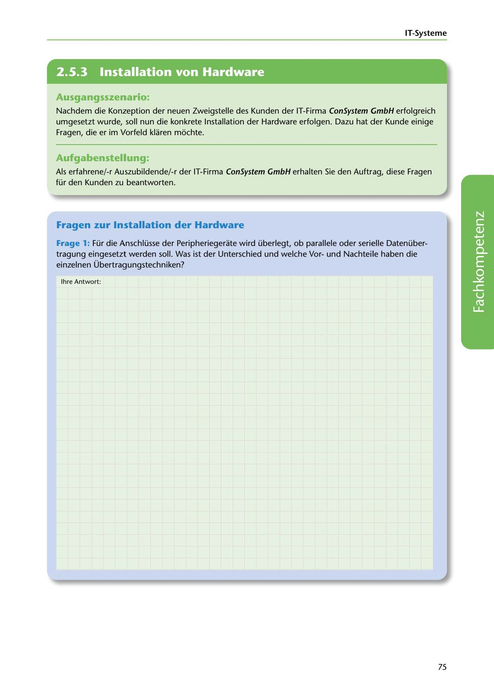

---
## Page 77
---

IT-Systerne

<!-- IMAGE: page-077-img-1.jpeg - TODO: Add description -->

**[VISUAL: CONSYSTEM GMBH SCENARIO HEADER]**
Header image for the ConSystem GmbH hardware installation questions exercise.

## Ausgangsszenario:

Nachdem die Konzeption der neuen Zweigstelle des Kunden der IT-Firma ConSystem GmbH erfolgreich umgesetzt wurde, soll nun die konkrete lnstallation der Hardware erfolgen. Dazu hat der Kunde einige Fragen, die er irn Vorfeld klaren mi::ichte.

## Aufgabenstellung:

Als erfahrene/-r Auszubildende/-r der IT-Firma ConSystem GmbH erhalten Sie den Auftrag, diese Fragen für den Kunden zu beantworten.

## Fragen zur lnstallation der Hardware

Frage 1: Für die Anschlüsse der Peripheriegerate wird überlegt, ob parallele oder serielle Datenüber- tragung eingesetzt werden soll. Was ist der Unterschied und welche Vorund Nachteile haben die einzelnen Übertragungstechniken?

lhre Antwort:

**[VISUAL: ANSWER SPACE]**
Blank lined area for students to explain the difference between parallel and serial data transmission, along with their advantages and disadvantages.

75
