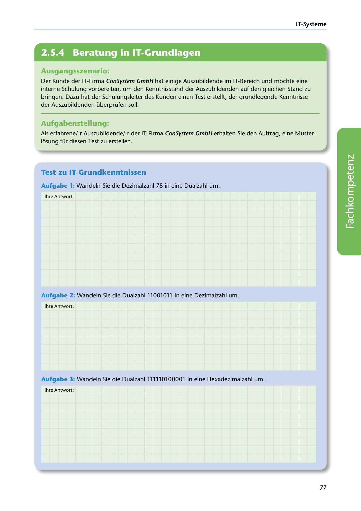

---
## Page 79
---

IT-Systerne

<!-- IMAGE: page-079-img-1.jpeg - TODO: Add description -->

**[VISUAL: CONSYSTEM GMBH SCENARIO HEADER]**
Header image for the ConSystem GmbH IT fundamentals test exercise.

## Ausgangsszenario:

Der Kunde der IT-Firma ConSystem GmbH hat einige Auszubildende im IT-Bereich und mochte eine interne Schulung vorbereiten, um den Kenntnisstand der Auszubildenden auf den gleichen Stand zu bringen. Dazu hat der Schulungsleiter des Kunden einen Test erstellt, der grundlegende Kenntnisse der Auszubildenden überprüfen soll.

## Aufgabenstellung:

Als erfahrene/-r Auszubildende/-r der IT-Firma ConSystem GmbH erhalten Sie den Auftrag, eine Muster- losung für diesen Test zu erstellen.

## Test zu IT-Grundkenntnissen

Aufgabe 1: Wandeln Sie die Dezimalzahl 78 in eine Dualzahl um.

lhre Antwort:

**[VISUAL: ANSWER SPACE]**
Blank space for students to show their binary/decimal/hexadecimal number conversion work.

Aufgabe 2: Wandeln Sie die Dualzahl 11001011 in eine Dezimalzahl um.

lhre Antwort:

Aufgabe 3: Wandeln Sie die Dualzahl 111110100001 in eine Hexadezimalzahl um.

lhre Antwort:

77
