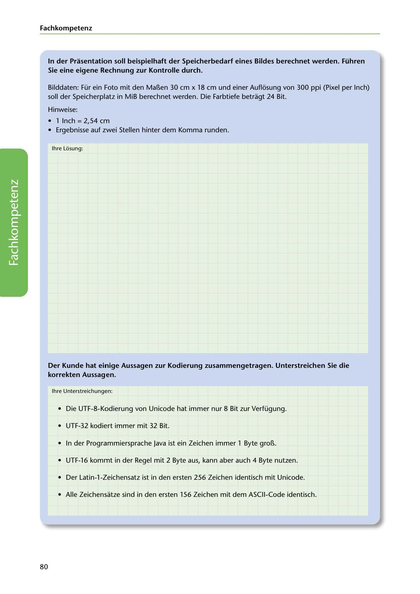

---
## Page 82
---

### Fach kom petenz

### Sie eine eigene Rechnung zur Kontrolle durch.

In der Prasentation soll beispielhaft der Speicherbedarf eines Bildes berechnet werden. Führen

Bilddaten: Für ein Foto mit den Mar.en 30 cm x 18 cm und einer Auflosung von 300 ppi (Pixel per lnch) soll der Speicherplatz in MiB berechnet werden. Die Farbtiefe betragt 24 Bit.

Hinweise:

## • 1 lnch = 2,54 cm

• Ergebnisse auf zwei Stellen hinter dem Komma runden.

lhre Losung:

<!-- IMAGE: page-082-img-1.jpeg - TODO: Add description -->

### korrekten Aussagen.

Der Kunde hat einige Aussagen zur Kodierung zusammengetragen. Unterstreichen Sie die

lhre Unterstreichungen:

• Die UTF-8-Kodierung von Unicode hat immer nur 8 Bit zur Verfügung.

• UTF-32 kodiert immer mit 32 Bit.

• In der Programmiersprache Java ist ein Zeichen immer 1 Byte gror...

• UTF-16 kommt in der Regel mit 2 Byte aus, kann aber auch 4 Byte nutzen.

• Der Latin-1-Zeichensatz ist in den ersten 256 Zeichen identisch mit Unicode.

• Alle Zeichensatze sind in den ersten 156 Zeichen mit dem ASCII-Code identisch.

80
