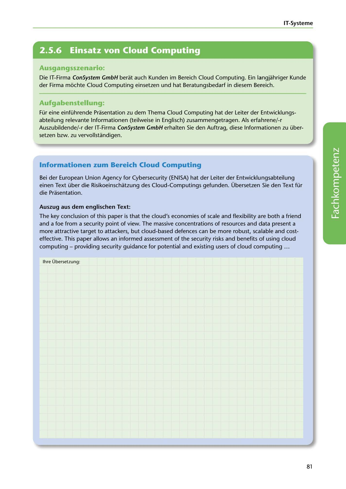

---
## Page 83
---

IT-Systerne

<!-- IMAGE: page-083-img-1.jpeg - TODO: Add description -->

**[VISUAL: CONSYSTEM GMBH SCENARIO HEADER]**
Header image for the ConSystem GmbH cloud computing consulting scenario.

## Ausgangsszenario:

Die IT-Firma ConSystem GmbH berat auch Kunden im Bereich Cloud Computing. Ein langjahriger Kunde der Firma mochte Cloud Computing einsetzen und hat Beratungsbedarf in diesem Bereich.

## Aufgabenstellung:

Für eine einführende Prasentation zu dem Thema Cloud Computing hat der Leiter der Entwicklungs- abteilung relevante lnfarmationen (teilweise in Englisch) zusammengetragen. Als erfahrene/-r Auszubildende/-r der IT-Firma ConSystem GmbH erhalten Sie den Auftrag, diese lnfarmationen zu über- setzen bzw. zu vervollstandigen.

## lnformationen zum Bereich Cloud Computing

Bei der European Union Agency far Cybersecurity (ENISA) hat der Leiter der Entwicklungsabteilung einen Text über die Risikoeinschatzung des Cloud-Computings gefunden. Übersetzen Sie den Text für die Prasentation.

### Auszug aus dern englischen Text:

The key conclusion of this paper is that the cloud's economies of scale and flexibility are both a friend

**[VISUAL: ENISA DOCUMENT EXCERPT]**
English text excerpt from the European Union Agency for Cybersecurity (ENISA) about cloud computing risk assessment, to be translated into German by students.

and a fae from a security point of view. The massive concentrations of resources and data present a more attractive target to attackers, but cloud-based defences can be more robust, scalable and cost- effective. This paper allows an infarmed assessment of the security risks and benefits of using cloud computing - providing security guidance far potential and existing users of cloud computing ...

lhre Übersetzung:

81
