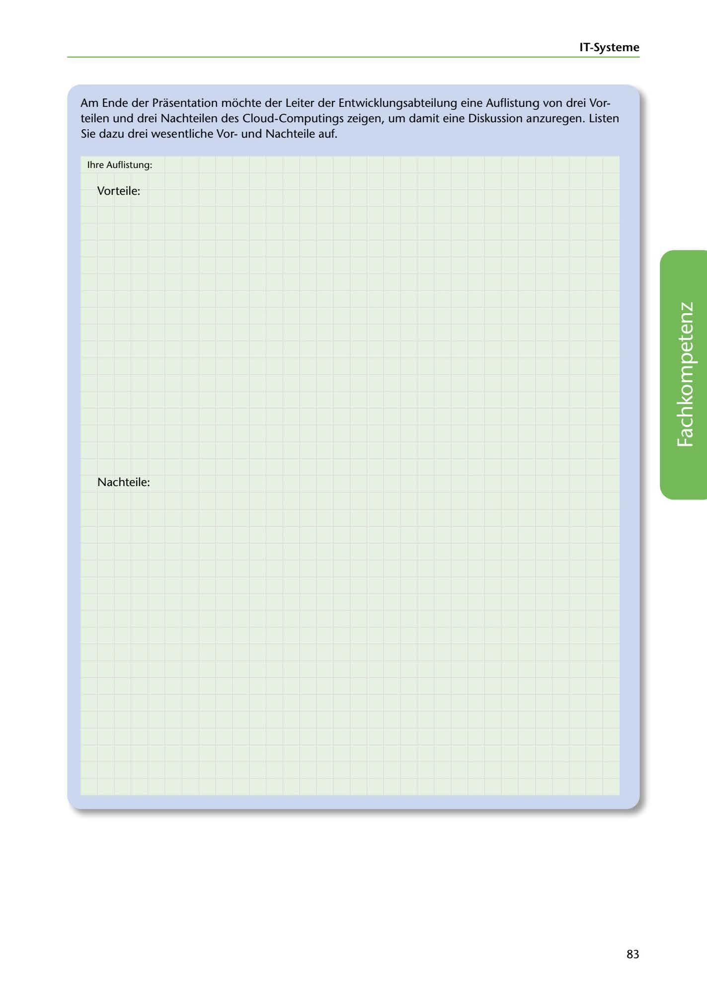

---
## Page 85
---

### IT-Systerne

Am Ende der Prasentation mochte der Leiter der Entwicklungsabteilung eine Auflistung von drei Vor- teilen und drei Nachteilen des Cloud-Computings zeigen, um damit eine Diskussion anzuregen. Listen Sie dazu drei wesentliche Vorund Nachteile auf.

lhre Auflistung:

Vorteile:

Nachteile:

<!-- IMAGE: page-085-img-1.jpeg - TODO: Add description -->

83
