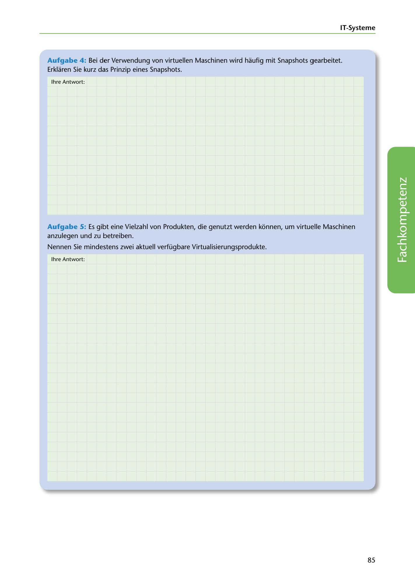

---
## Page 87
---

### IT-Systerne

Aufgabe 4: Bei der Verwendung von virtuellen Maschinen wird haufig mit Snapshots gearbeitet. Erklaren Sie kurz das Prinzip eines Snapshots.

lhre Antwort:

Aufgabe 5: Es gibt eine Vielzahl von Produkten, die genutzt werden konnen, urn virtuelle Maschinen anzulegen und zu betreiben.

Nennen Sie mindestens zwei aktuell verfügbare Virtualisierungsprodukte.

lhre Antwort:

<!-- IMAGE: page-087-img-1.jpeg - TODO: Add description -->

85
