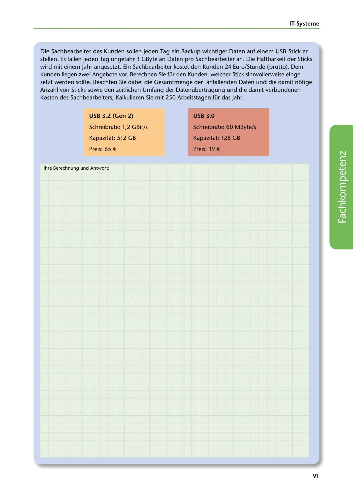

---
## Page 93
---

### IT-Systerne

Die Sachbearbeiter des Kunden sollen jeden Tag ein Backup wichtiger Daten auf einem USB-Stick er- stellen. Es fallen jeden Tag ungefahr 3 GByte an Daten pro Sachbearbeiter an. Die Haltbarkeit der Sticks wird mit einem Jahr angesetzt. Ein Sachbearbeiter kostet den Kunden 24 Euro/Stunde (brutto). Dem Kunden liegen zwei Angebote vor. Berechnen Sie für den Kunden, welcher Stick sinnvollerweise einge- setzt werden sollte. Beachten Sie dabei die Gesamtmenge der anfallenden Daten und die damit notige Anzahl von Sticks sowie den zeitlichen Umfang der Datenübertragung und die damit verbundenen

Kosten des Sachbearbeiters, Kalkulieren Sie mit 250 Arbeitstagen für das Jahr.

### USB 3.2 (Gen 2)

### USB 3.0

Schreibrate: 1,2 GBit/s

### Schreibrate: 60 MByte/s

Kapazitat: 512 GB

### Kapazitat: 128 GB

Preis: 65 €

### Preis: 19 €

lhre Berechnung und Antwort:

<!-- IMAGE: page-093-img-1.jpeg - TODO: Add description -->

91
