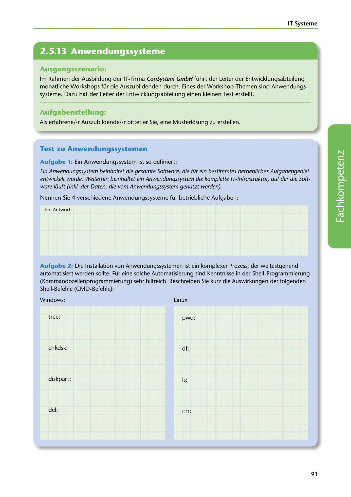

---
## Page 95
---

IT-Systerne

<!-- IMAGE: page-095-img-1.jpeg - TODO: Add description -->

**[VISUAL: CONSYSTEM GMBH SCENARIO HEADER]**
Header image for the ConSystem GmbH application systems workshop scenario.

## Ausgangsszenario:

lm Rahmen der Ausbildung der IT-Firma ConSystem GmbH führt der Leiter der Entwicklungsabteilung monatliche Workshops für die Auszubildenden durch. Eines der Workshop-Themen sind Anwendungs- systeme. Dazu hat der Leiter der Entwicklungsabteilung einen kleinen Test erstellt.

## Aufgabenstellung:

Als erfahrene/-r Auszubildende/-r bittet er Sie, eine Musterlosung zu erstellen.

## Test zu Anwendungssystemen

### Aufgabe 1: Ein Anwendungssystem ist so definiert:

Ein Anwendungssystem beinhaltet die gesamte Software, die für ein bestimmtes betriebliches Aufgabengebiet entwicke/t wurde. Weiterhin beinha/tet ein Anwendungssystem die komplette IT-lnfrastruktur, auf der die Soft- ware liiuft (inkl. der Daten, die vom Anwendungssystem genutzt werden).

Nennen Sie 4 verschiedene Anwendungssysteme für betriebliche Aufgaben:

lhre Antwort:

**[VISUAL: ANSWER SPACE]**
Blank lined area for students to list four different business application systems.

Aufgabe 2: Die lnstallation van Anwendungssystemen ist ein komplexer Prozess, der weitestgehend automatisiert werden sollte. Für eine solche Automatisierung sind Kenntnisse in der Shell-Programmierung (Kommandozeilenprogrammierung) sehr hilfreich. Beschreiben Sie kurz die Auswirkungen der folgenden Shell-Befehle (CMD-Befehle):

Windows: Linux

tree: pwd:

chkdsk: df:

diskpart: Is:

del: rm:

93
