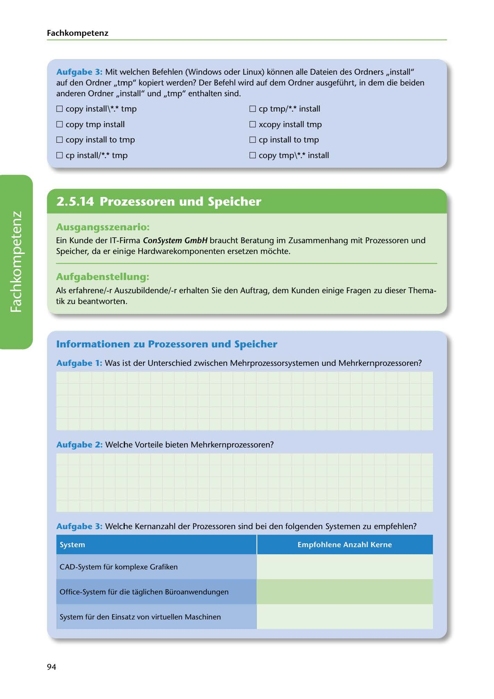

---
## Page 96
---

Fach kom petenz

Aufgabe 3: Mit welchen Befehlen (Windows oder Linux) konnen alle Dateien des Ordners ,,install" auf den Ordner ,,tmp" kopiert werden? Der Befehl wird auf dem Ordner ausgeführt, in dem die beiden anderen Ordner ,,install" und ,,tmp" enthalten sind.

O copy install\ *.* tmp

O cp tmp/*.* install

O copy tmp installl

O xcopy install tmp

O copy install to tmp

O cp install to tmp

O cp install/*.* tmp

O copy tmp\*.* install

<!-- IMAGE: page-096-img-1.jpeg - TODO: Add description -->

**[VISUAL: CONSYSTEM GMBH SCENARIO HEADER]**
Header image for the ConSystem GmbH processor and memory consulting scenario.

## Ausgangsszenario:

Ein Kunde der IT-Firma ConSystem GmbH braucht Beratung im Zusammenhang mit Prozessoren und Speicher, da er einige Hardwarekomponenten ersetzen mochte.

## Aufgabenstellung:

Als erfahrene/-r Auszubildende/-r erhalten Sie den Auftrag, dem Kunden einige Fragen zu dieser Thema- tik zu beantworten.

**[VISUAL: PROCESSOR CORE RECOMMENDATIONS TABLE]**
A table for matching recommended processor core counts to different system types: CAD systems, office systems, and virtual machine hosts.

## lnformationen zu Prozessoren und Speicher

Aufgabe 1: Was ist der Unterschied zwischen Mehrprozessorsystemen und Mehrkernprozessoren?

### Aufgabe 2: Welche Vorteile bieten Mehrkernprozessoren?

Aufgabe 3: Welche Kernanzahl der Prozessoren sind bei den folgenden Systemen zu empfehlen?

System Empfohlene Anzahl Kerne

CAD-System für komplexe Grafiken

Office-System für die taglichen Büroanwendungen

System für den Einsatz von virtuellen Maschinen

94
