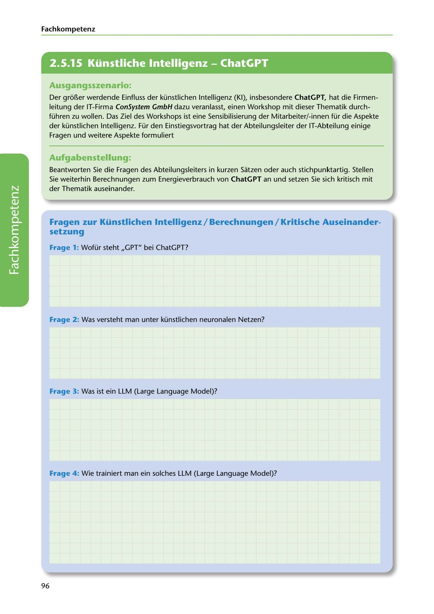

---
## Page 98
---

Fach kom petenz

<!-- IMAGE: page-098-img-1.jpeg - TODO: Add description -->

**[VISUAL: CONSYSTEM GMBH SCENARIO HEADER]**
Header image for the ConSystem GmbH artificial intelligence (AI/KI) workshop scenario.

### Ausgangsszenario:

Der gror..er werdende Einfluss der künstlichen lntelligenz (KI), insbesondere ChatGPT, hat die Firmen- leitung der IT-Firma ConSystem GmbH dazu veranlasst, einen Workshop mit dieser Thematik durch- führen zu wollen. Das Ziel des Workshops ist eine Sensibilisierung der Mitarbeiter/-innen für die Aspekte der künstlichen lntelligenz. Für den Einstiegsvortrag hat der Abteilungsleiter der IT-Abteilung einige

Fragen und weitere Aspekte formuliert

### Aufgabenstellung:

Beantworten Sie die Fragen des Abteilungsleiters in kurzen Satzen oder auch stichpunktartig. Stellen Sie weiterhin Berechnungen zum Energieverbrauch von ChatGPT an und setzen Sie sich kritisch mit der Thematik auseinander.

### setzung

Fragen zur Künstlichen lntelligenz / Berechnungen / Kritische Auseinander-

### Frage 1: Wofür steht ,,GPT" bei ChatGPT?

**[VISUAL: ANSWER SPACE]**
Blank lined area for students to answer questions about artificial intelligence, ChatGPT, and neural networks.

Frage 2: Was versteht man unter künstlichen neuronalen Netzen?

### Frage 3: Was ist ein LLM (Large Language Model)?

Frage 4: Wie trainiert man ein solches LLM (Large Language Model)?

96
