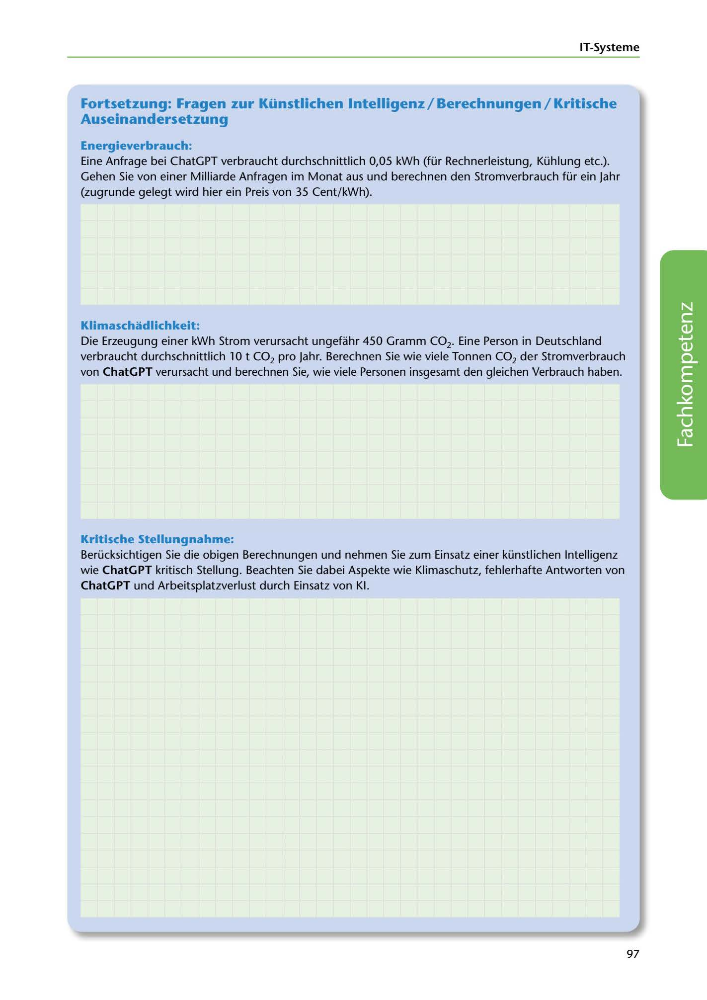

---
## Page 99
---

IT-Systerne

## Fortsetzung: Fragen zur Künstlichen lntelligenz / Berechnungen / Kritische

### Auseinandersetzung

### Energieverbrauch:

Eine Anfrage bei ChatGPT verbraucht durchschnittlich 0,05 kWh (für Rechnerleistung, Kühlung etc.). Gehen Sie von einer Milliarde Anfragen im Monat aus und berechnen den Stromverbrauch für ein Jahr (zugrunde gelegt wird hier ein Preis von 35 Cent/kWh).

### Klimaschadlichkeit:

Die Erzeugung einer kWh Strom verursacht ungefahr 450 Gramm CO2. Eine Person in Deutschland verbraucht durchschnittlich 10 t CO2 pro Jahr. Berechnen Sie wie viele Tonnen CO2 der Stromverbrauch von ChatGPT verursacht und berechnen Sie, wie viele Personen insgesamt den gleichen Yerbrauch haben.

<!-- IMAGE: page-099-img-1.jpeg - TODO: Add description -->

### Kritische Stellungnahme:

### ChatGPT und Arbeitsplatzverlust durch Einsatz von KI.

Berücksichtigen Sie die obigen Berechnungen und nehmen Sie zum Einsatz einer künstlichen lntelligenz wie ChatGPT kritisch Stellung. Beachten Sie dabei Aspekte wie Klimaschutz, fehlerhaft:e Antworten von

97
