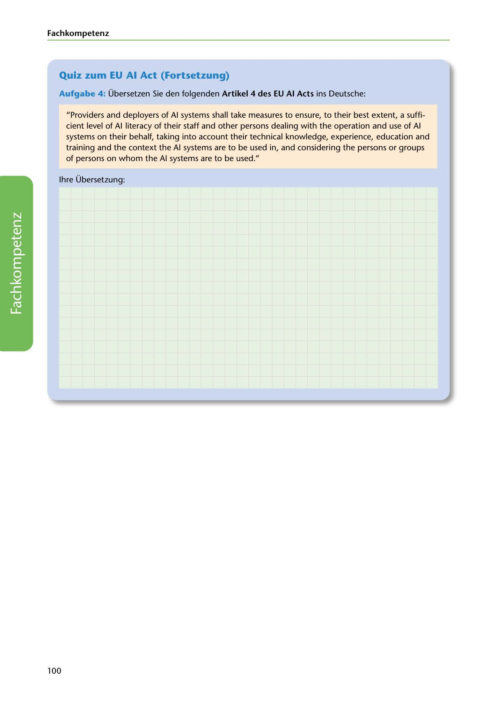

---
## Page 102
---

### Fach kom petenz

### Quiz zum EU Al Act (Fortsetzung)

Aufgabe 4: Übersetzen Sie den folgenden Artikel 4 des EU Al Acts ins Deutsche:

"Providers and deployers of Al systems shall take measures to ensure, to their best extent, a suffi- cient level of Al literacy of their staff and other persons dealing with the operation and use of Al systems on theiir behalf, taking into account their technical knowledge, experience, education and training and the context the Al systems are to be used in, and considering the persons or groups of persons on whom the Al systems are to be used."

lhre Übersetzung:

<!-- IMAGE: page-102-img-1.jpeg - TODO: Add description -->

100
