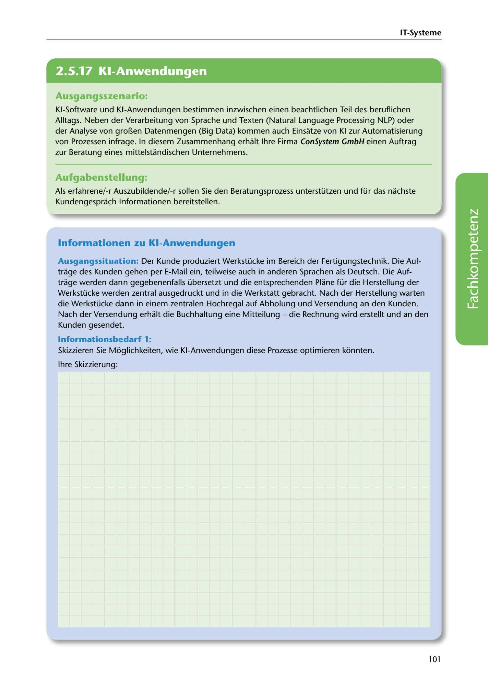

---
## Page 103
---

IT-Systerne

<!-- IMAGE: page-103-img-1.jpeg - TODO: Add description -->

**[VISUAL: CONSYSTEM GMBH SCENARIO HEADER]**
Header image for the ConSystem GmbH AI process automation consulting scenario.

### Ausgangsszenario:

KI-Software und KI-Anwendungen bestimmen inzwischen einen beachtlichen Teil des beruflichen Alltags. Neben der Verarbeitung von Sprache und Texten (Natural Language Processing NLP) oder der Analyse von gror..en Datenmengen (Big Data) kommen auch Einsatze von KI zur Automatisierung von Prozessen infrage. In diesem Zusammenhang erhalt lhre Firma ConSystem GmbH einen Auftrag zur Beratung eines mittelstandischen Unternehmens.

### Aufgabenstellung:

Als erfahrene/-r Auszubildende/-r sallen Sie den Beratungsprozess unterstützen und für das nachste

Kundengesprach l11formationen bereitstellen.

### lnformationen zu KI-Anwendungen

Ausgangssituation: Der Kunde produziert Werkstücke im Bereich der Fertigungstechnik. Die Auf- trage des Kunden gehen per E-Mail ein, teilweise auch in anderen Sprachen als Deutsch. Die Auf- trage werden dann gegebenenfalls übersetzt und die entsprechenden Plane für die Herstellung der Werkstücke werden zentral ausgedruckt und in die Werkstatt gebracht. Nach der Herstellung warten die Werkstücke dann in einem zentralen Hochregal auf Abholung und Versendung an den Kunden. Nach der Versendung erhalt die Buchhaltung eine Mitteilung - die Rechnung wird erstellt und anden Kunden gesendet.

**[VISUAL: AI PROCESS OPTIMIZATION DIAGRAM SPACE]**
Area for students to sketch how AI applications could optimize the described manufacturing workflow (email order processing, translation, manufacturing plans, warehouse management, and invoicing).

### lnformationsbedañ 1:

Skizzieren Sie Moglichkeiten, wie KI-Anwendungen diese Prozesse optimieren konnten.

lhre Skizzierung:

101
