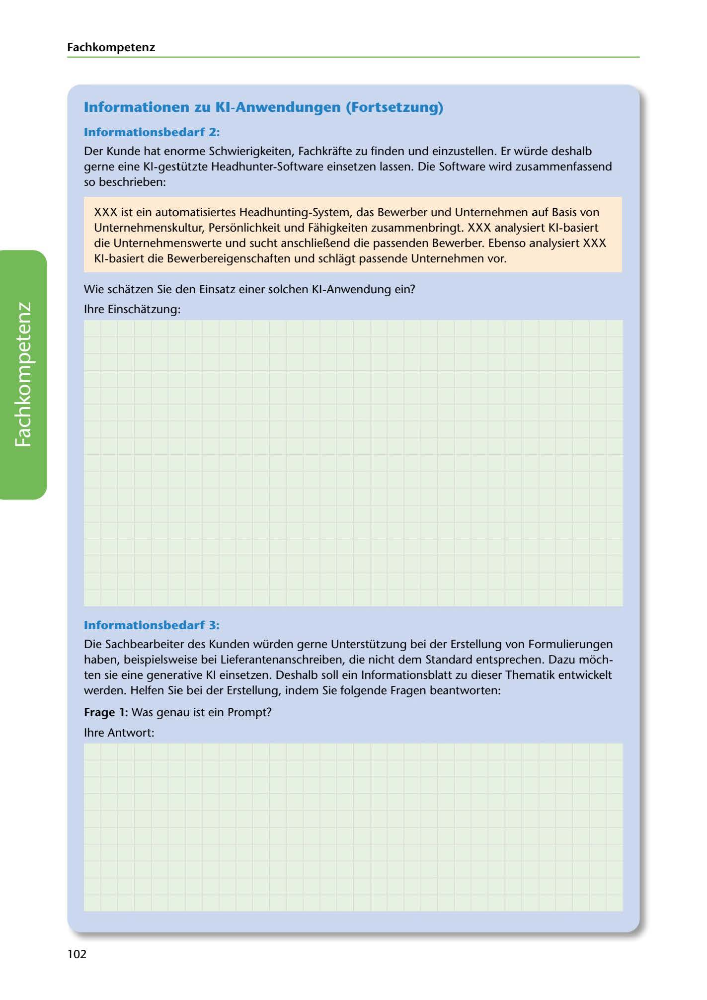

---
## Page 104
---

### Fach kom petenz

### lnformationen zu KI-Anwendungen (Fortsetzung)

### lnformationsbedarf 2:

Der Kunde hat enorme Schwierigkeiten, Fachkrafte zu finden und einzustellen. Er würde deshalb gerne eine Kl-gestützte Headhunter-Software einsetzen lassen. Die Software wird zusammenfassend so beschrieben:

XXX ist ein automatisiertes Headhunting-System, das Bewerber und Unternehmen auf Basis von Unternehmenskultur, Personlichkeit und Fahigkeiten zusammenbringt. XXX analysiert Kl-basiert die Unternehmenswerte und sucht anschlie~end die passenden Bewerber. Ebenso analysiert XXX Kl-basiert die Bewerbereigenschaften und schlagt passende Unternehmen vor.

Wie schatzen Sie den Einsatz einer solchen KI-Anwendung ein?

lhre Einschatzung:

<!-- IMAGE: page-104-img-1.jpeg - TODO: Add description -->

### lnformationsbedarf 3:

Die Sachbearbeiter des Kunden würden gerne Unterstützung bei der Erstellung von Formulierungen haben, beispielsweise bei Lieferantenanschreiben, die nicht dem Standard entsprechen. Dazu moch- ten sie eine generative KI einsetzen. Deshalb soll ein lnformationsblatt zu dieser Thematik entwickelt werden. Helfen Sie bei der Erstellung, indem Sie folgende Fragen beantworten:

### Frage 1: Was genau ist ein Prompt?

lhre Antwort:

102
