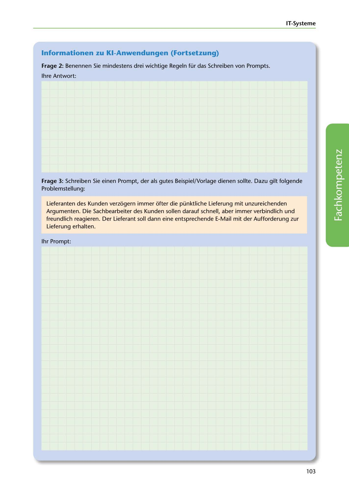

---
## Page 105
---

IT-Systerne

### lnformationen zu KI-Anwendungen (Fortsetzung)

Frage 2: Benennen Sie mindestens drei wichtige Regeln für das Schreiben von Prompts.

lhre Antwort:

Frage 3: Schreiben Sie einen Prompt, der als gutes Beispiel/Vorlage dienen sollte. Dazu gilt folgende Problemstellung:

Lieferanten des Kunden verzogern immer ofter die pünktliche Lieferung mit unzureichenden Argumenten. Die Sachbearbeiter des Kunden sallen darauf schnell, aber immer verbindlich und freundlich reagieren. Der Lieferant soll dann eine entsprechende E-Mail mit der Aufforderung zur Lieferung erhalten.

1hr Prompt:

<!-- IMAGE: page-105-img-1.jpeg - TODO: Add description -->

103
