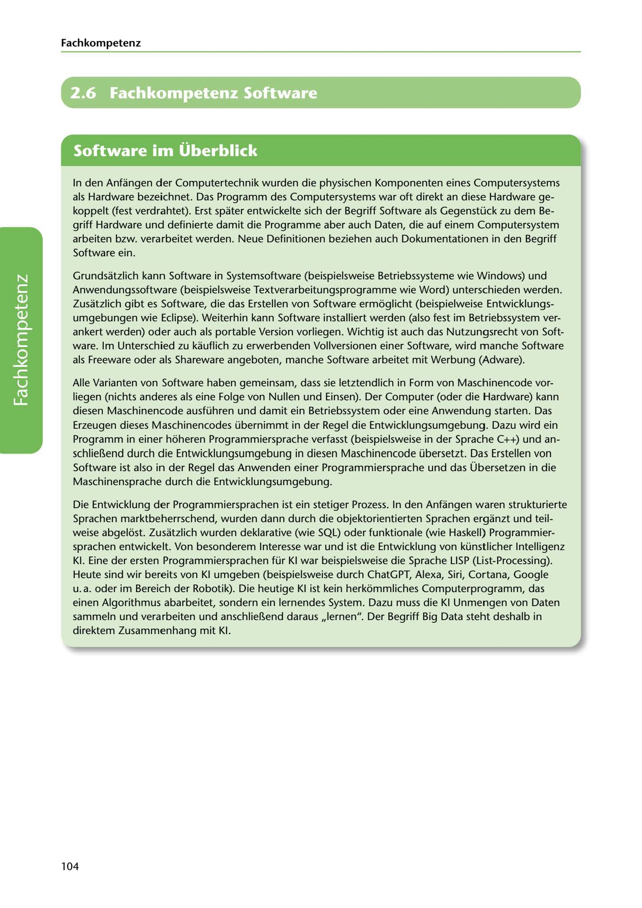

---
## Page 106
---

### Fach kom petenz

# 2.6 Fachkompetenz Software

<!-- IMAGE: page-106-img-1.jpeg - TODO: Add description -->

**[VISUAL: SOFTWARE SECTION HEADER]**
Chapter header image for "2.6 Fachkompetenz Software" (Professional Competency in Software) section, featuring programming and software development graphics.

In den Anfangen der Computertechnik wurden die physischen Komponenten eines Computersystems als Hardware bezeichnet. Das Programm des Computersystems war oft direkt an diese Hardware ge- koppelt (fest verdrahtet). Erst spater entwickelte sich der Begriff Software als Gegenstück zu dem Be- griff Hardware und definierte damit die Programme aber auch Daten, die auf einem Computersystem arbeiten bzw. verarbeitet werden. Neue Definitionen beziehen auch Dokumentationen in den Begriff Software ein.

Grundsatzlich kann Software in Systemsoftware (beispielsweise Betriebssysteme wie Windows) und Anwendungssoftware (beispielsweise Textverarbeitungsprogramme wie Word) unterschieden werden. Zusatzlich gibt es Software, die das Erstellen von Software ermoglicht (beispielweise Entwicklungs- umgebungen wie Eclipse). Weiterhin kann Software installiert werden (also fest im Betriebssystem ver- ankert werden) oder auch als portable Version vorliegen. Wichtig ist auch das Nutzungsrecht von Soft- ware. lm Unterschied zu kauflich zu erwerbenden Vollversionen einer Software, wird manche Software als Freeware oder als Shareware angeboten, manche Software arbeitet mit Werbung (Adware).

Alle Varianten von Software haben gemeinsam, dass sie letztendlich in Form von Maschinencode vor-

**[VISUAL: SOFTWARE DEVELOPMENT LIFECYCLE DIAGRAM]**
Diagram illustrating the software development process from high-level programming languages through compilation to machine code, and the evolution of programming paradigms from structured to object-oriented to AI.

liegen (nichts anderes als eine Folge von Nullen und Einsen). Der Computer (oder die Hardware) kann diesen Maschinencode ausführen und damit ein Betriebssystem oder eine Anwendung starten. Das Erzeugen dieses Maschinencodes übernimmt in der Regel die Entwicklungsumgebung. Dazu wird ein Programm in einer hoheren Programmiersprache verfasst (beispielsweise in der Sprache C++) und an- schlie~end durch die Entwicklungsumgebung in diesen Maschinencode übersetzt. Das Erstellen von Software ist also in der Regel das Anwenden einer Programmiersprache und das Übersetzen in die Maschinensprache durch die Entwicklungsumgebung.

Die Entwicklung der Programmiersprachen ist ein stetiger Prozess. In den Anfangen waren strukturierte Sprachen marktbeherrschend, wurden dann durch die objektorientierten Sprachen erganzt und teil- weise abgelost. Zusatzlich wurden deklarative (wie SQL) oder funktionale (wie Haskell) Programmier- sprachen entwickelt. Von besonderem lnteresse war und ist die Entwicklung von künstlicher lntelligenz KI. Eine der ersten Programmiersprachen für KI war beispielsweise die Sprache LISP (List-Processing). Heute sind wir bereits von KI umgeben (beispielsweise durch ChatGPT, Alexa, Siri, Cortana, Google u. a. oder im Bereich der Robotik). Die heutige KI ist kein herkommliches Computerprogramm, das einen Algorithmus abarbeitet, sondern ein lernendes System. Dazu muss die KI Unmengen von Daten sammeln und verarbeiten und anschlie~end daraus ,,lernen". Der Begriff Big Data steht deshalb in direktem Zusammenhang mit KI.

104
