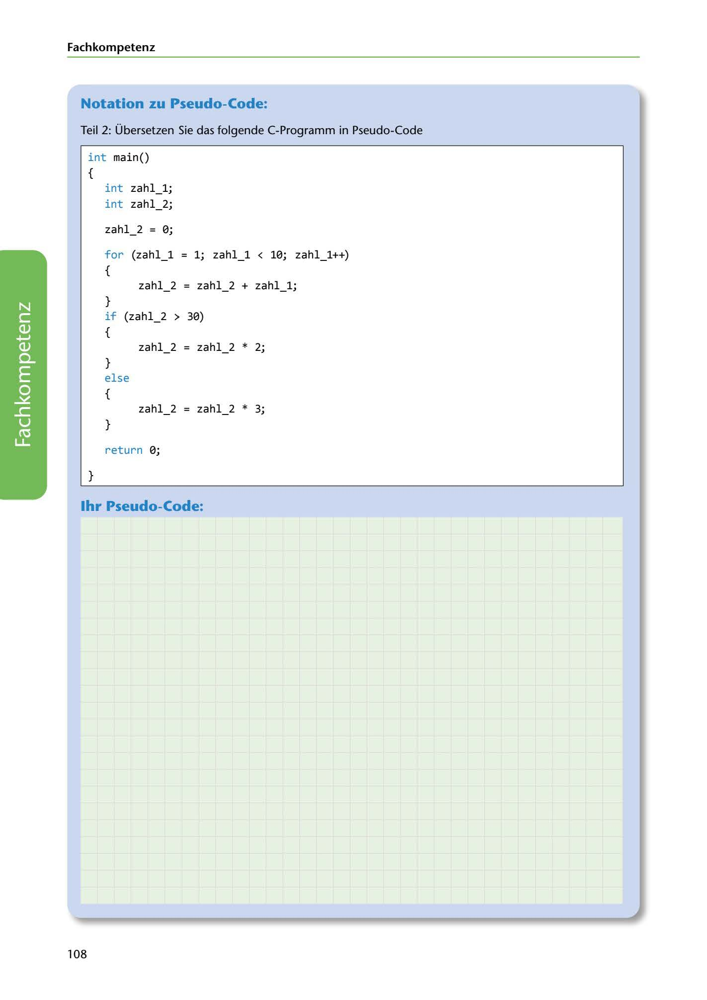

---
## Page 110
---

Fach kom petenz

### Notation zu Pseudo-Code:

Teil 2: Übersetzen Sie das folgende C-Programm in Pseudo-Code

## int main()

{

## int zahl_l;

## int zahl_2;

zahl_2 = 0;

## for (zahl_l = 1; zahl_l < 10; zahl_l++)

{

## if (zahl_2 > 30)

zahl_2 = zahl_2 + zahl_l ; } {

# zahl 2 = zahl 2 * 2;

- } else {

# zahl_2 = zahl_2 * 3;

}

return 0;

}

<!-- IMAGE: page-110-img-1.jpeg - TODO: Add description -->

### 1hr Pseudo-Code:

108
