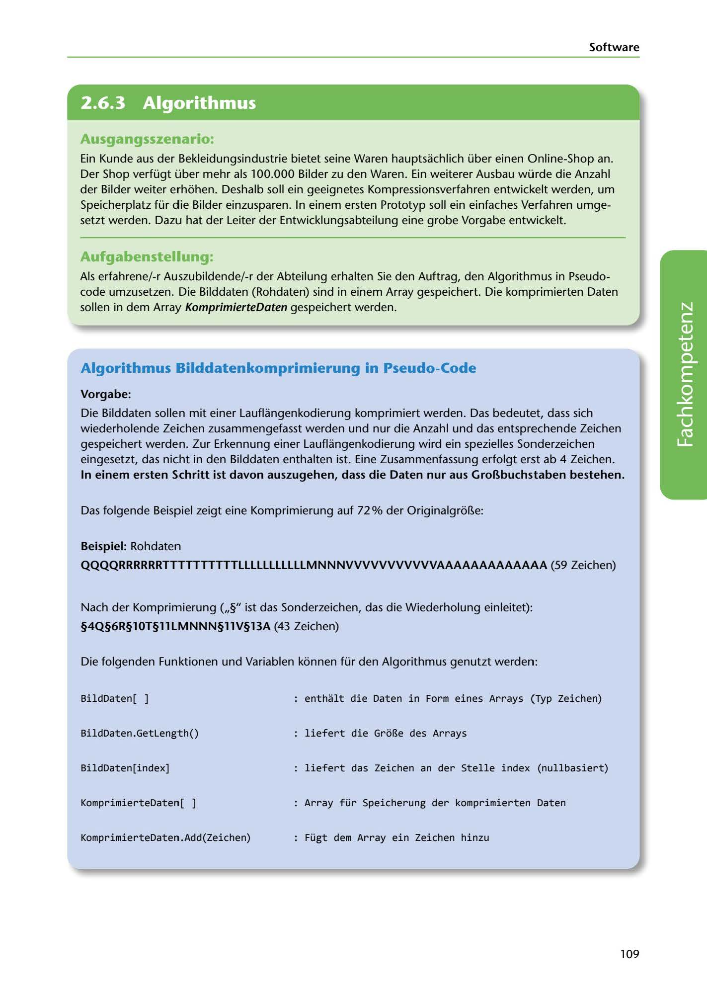

---
## Page 111
---

Software

<!-- IMAGE: page-111-img-1.jpeg - TODO: Add description -->

**[VISUAL: CONSYSTEM GMBH SCENARIO HEADER]**
Header image for the ConSystem GmbH image compression algorithm development scenario.

### Ausgangsszenario:

Ein Kunde aus der Bekleidungsindustrie bietet seine Waren hauptsachlich über einen Online-Shop an. Der Shop verfügt über mehr als 100.000 Bilder zu den Waren. Ein weiterer Ausbau würde die Anzahl der Bilder weiter erhohen. Deshalb soll ein geeignetes Kompressionsverfahren entwickelt werden, um Speicherplatz für die Bilder einzusparen. In einem ersten Prototyp soll ein einfaches Verfahren umge- setzt werden. Dazu hat der Leiter der Entwicklungsabteilung eine grobe Vorgabe entwickelt.

### Aufgabenstellung:

Als erfahrene/-r Auszubildende/-r der Abteilung erhalten Sie den Auftrag, den Algorithmus in Pseudo- code umzusetzen. Die Bilddaten (Rohdaten) sind in einem Array gespeichert. Die komprimierten Daten sollen in dem Array KomprimierteDaten gespeichert werden.

### Algorithmus Bilddatenkomprimierung in Pseudo-Code

### Vorgabe:

Die Bilddaten sollen mit einer Lauflangenkodierung komprimiert werden. Das bedeutet, dass sich wiederholende Zeichen zusammengefasst werden und nur die Anzahl und das entsprechende Zeichen gespeichert werden. Zur Erkennung einer Lauflangenkodierung wird ein spezielles Sonderzeichen eingesetzt, das nicht in den Bilddaten enthalten ist. Eine Zusammenfassung erfolgt erst ab 4 Zeichen. In einem ersten Schritt ist davon auszugehen, dass die Daten nur aus GroBbuchstaben bestehen.

**[VISUAL: RUN-LENGTH ENCODING EXAMPLE]**
Visual illustration of run-length encoding (Lauflängenkodierung) compression algorithm showing how repeated characters are compressed by storing count and character instead of repeating characters.

Das folgende Beispiel zeigt eine Komprimierung auf 72% der Originalgror..e:

### Beispiel: Rohdaten

QQQQRRRRRRTTTTTTTTTTLLLLLLLLLLLMNNNVVVVVVVVVVVAAAAAAAAAAAAA (59 Zeichen)

Nach der Komprimierung (,,§" ist das Sonderzeichen, das die Wiederholung einleitet):

### §4Q§6R§lOT§11LMNNN§llV§13A (43 Zeichen)

Die folgenden Funktionen und Variablen konnen für den Algorithmus genutzt werden:

BildDaten[ ] enthalt die Daten in Form eines Arrays (Typ Zeichen)

BildDaten.Getlength() liefert die GroBe des Arrays

BildDaten[index] liefert das Zeichen an der Stelle index (nullbasiert)

KomprimierteDaten[ ] Array für Speicherung der komprimierten Daten

KomprimierteDaten.Add(Zeichen) Fügt dem Array ein Zeichen hinzu

109
