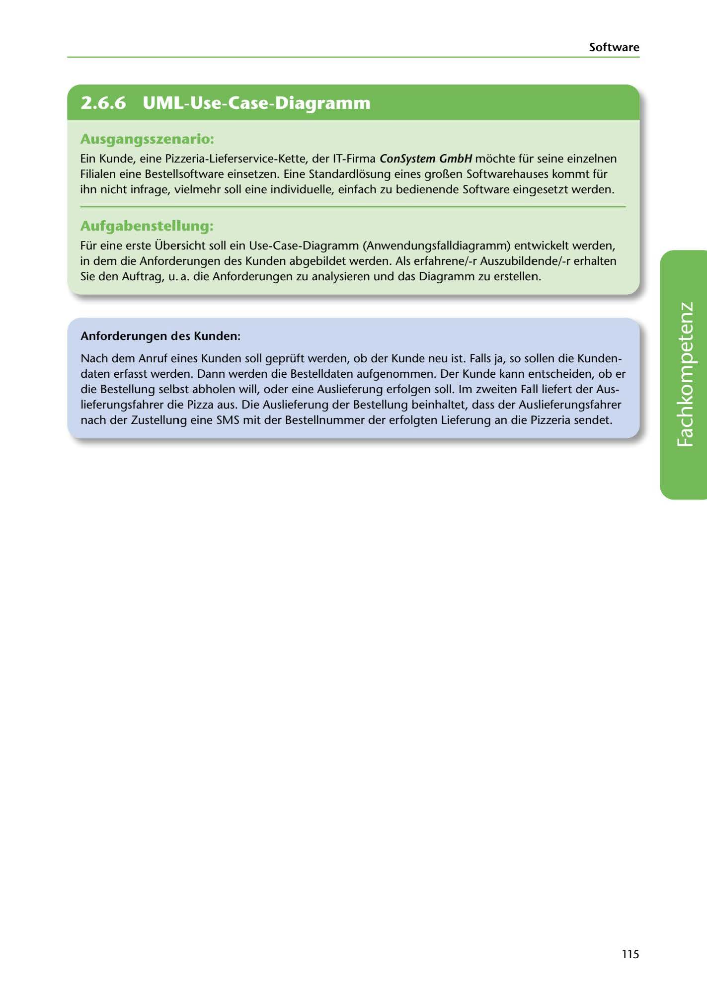

---
## Page 117
---

Software

<!-- IMAGE: page-117-img-1.jpeg - TODO: Add description -->

**[VISUAL: CONSYSTEM GMBH SCENARIO HEADER]**
Header image for the ConSystem GmbH pizzeria order software UML use case diagram exercise.

## Ausgangsszenario:

Ein Kunde, eine Pizzeria-Lieferservice-Kette, der IT-Firma ConSystem GmbH mochte für seine einzelnen Filialen eine Bestelllsoftware einsetzen. Eine Standardlosung eines gro~en Softwarehauses kommt für ihn nicht infrage, vielmehr soll eine individuelle, einfach zu bedienende Software eingesetzt werden.

## Aufgabenstellung:

Für eine erste Übersicht soll ein Use-Case-Diagramm (Anwendungsfalldiagramm) entwickelt werden, in dem die Anforderungen des Kunden abgebildet werden. Als erfahrene/-r Auszubildende/-r erhalten Sie den Auftrag, u.a. die Anforderungen zu analysieren und das Diagramm zu erstellen.

### Anforderungen des Kunden:

Nach dem Anruf e1ines Kunden soll geprüft werden, ob der Kunde neu ist. Falls ja, so sollen die Kunden- daten erfasst werden. Dann werden die Bestelldaten aufgenommen. Der Kunde kann entscheiden, ob er die Bestellung selbst abholen will, oder eine Auslieferung erfolgen soll. lm zweiten Fall liefert der Aus- lieferungsfahrer die Pizza aus. Die Auslieferung der Bestellung beinhaltet, dass der Auslieferungsfahrer nach der Zustellung eine SMS mit der Bestellnummer der erfolgten Lieferung an die Pizzeria sendet.

**[VISUAL: USE CASE DIAGRAM TEMPLATE]**
Blank space for students to create a UML use case diagram (Anwendungsfalldiagramm) for the pizzeria order system, showing actors (customer, delivery driver) and use cases (check if new customer, capture customer data, take order, deliver order, send SMS confirmation).

115
