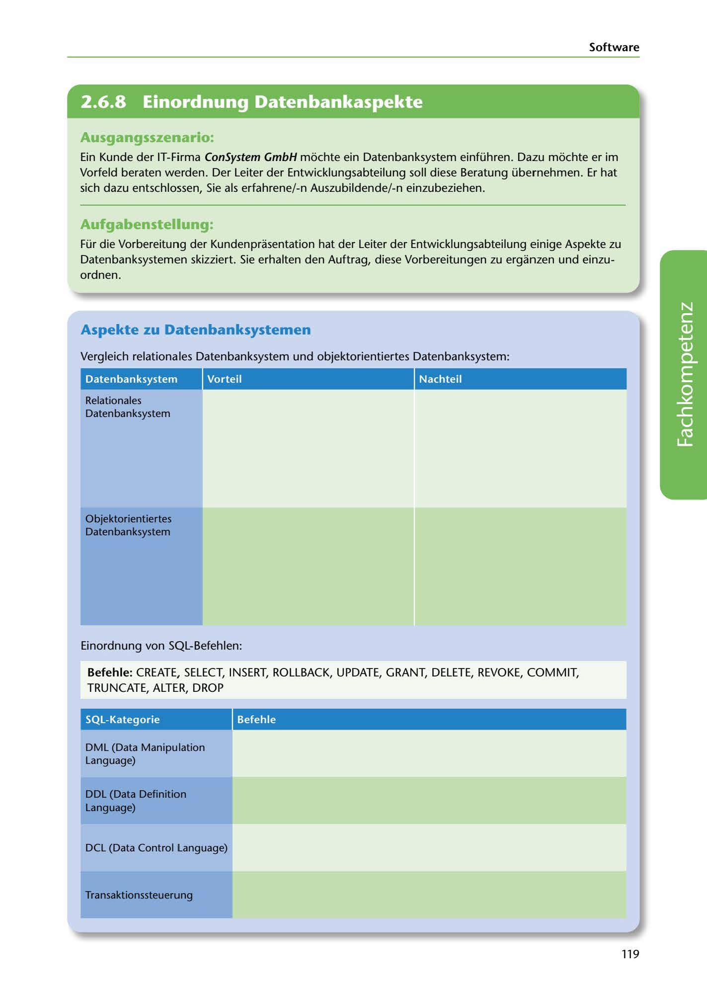

---
## Page 121
---

Software

<!-- IMAGE: page-121-img-1.jpeg - TODO: Add description -->

**[VISUAL: CONSYSTEM GMBH SCENARIO HEADER]**
Header image for the ConSystem GmbH database systems consulting scenario.

## Ausgangsszenario:

Ein Kunde der IT-Firma ConSystem GmbH mochte ein Datenbanksystem einführen. Dazu mochte er im Vorfeld beraten werden. Der Leiter der Entwicklungsabteilung soll diese Beratung übernehmen. Er hat sich dazu entschlossen, Sie als erfahrene/-n Auszubildende/-n einzubeziehen.

## Aufgabenstellung.

Für die Vorbereitung der Kundenprasentation hat der Leiter der Entwicklungsabteilung einige Aspekte zu Datenbanksystemen skizziert. Sie erhalten den Auftrag, diese Vorbereitungen zu erganzen und einzu- ordnen.

## Aspekte zu Datenbanksystemen

Vergleich relationales Datenbanksystem und objektorientiertes Datenbanksystem:

Datenban ksystem

Vorteil

Nachteil

Relationales Datenbanksystem

**[VISUAL: DATABASE COMPARISON TABLE]**
A comparison table with columns for Datenbanksystem (type), Vorteil (advantages), and Nachteil (disadvantages), comparing:
- Relationales Datenbanksystem (RDBMS)
- Objektorientiertes Datenbanksystem (OODBMS)

### Objektorientiertes

### Datenbanksystem

Einordnung von SQL-Befehlen:

Befehle: CREATE, SELECT, INSERT, ROLLBACK, UPDATE, GRANT, DELETE, REVOKE, COMMIT, TRUNCATE, ALTER, DROP

### SQL-Kategorie

Befehle

DML (Data Manipulation Language)

DDL (Data Definition Language)

DCL (Data Control tanguage)

Transaktionssteuerung

119
