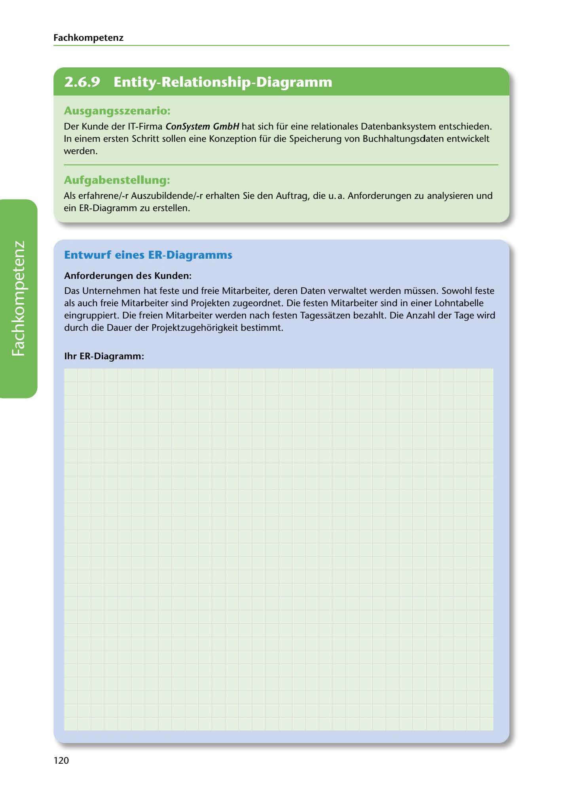

---
## Page 122
---

Fach kom petenz

<!-- IMAGE: page-122-img-1.jpeg - TODO: Add description -->

**[VISUAL: CONSYSTEM GMBH SCENARIO HEADER]**
Header image for the ConSystem GmbH ER diagram design exercise for accounting database.

## Ausgangsszenario:

Der Kunde der IT-Firma ConSystem GmbH hat sich für eine relationales Datenbanksystem entschieden. In einem ersten Schritt sallen eine Konzeption für die Speicherung von Buchhaltungsdaten entwickelt werden.

## Aufgabenstellung:

Als erfahrene/-r Auszubildende/-r erhalten Sie den Auttrag, die u.a. Anforderungen zu analysieren und ein ER-Diagramm zu erstellen.

## Entwurf eines ER-Diagramms

### Anforderungen des Kunden:

Das Unternehmen hat teste und freie Mitarbeiter, deren Daten verwaltet werden müssen. Sowohl teste als auch freie Mitarbeiter sind Projekten zugeordnet. Die testen Mitarbeiter sind in einer Lohntabelle eingruppiert. Die freien Mitarbeiter werden nach testen Tagessatzen bezahlt. Die Anzahl der Tage wird durch die Dauer der Projektzugehorigkeit bestimmt.

### 1hr ER-Diagramm:

**[VISUAL: ER DIAGRAM TEMPLATE]**
Blank space for students to create an Entity-Relationship diagram modeling: Mitarbeiter (feste and freie), Projekte, Lohntabelle, and Tagessätze with appropriate relationships and cardinalities.

120
