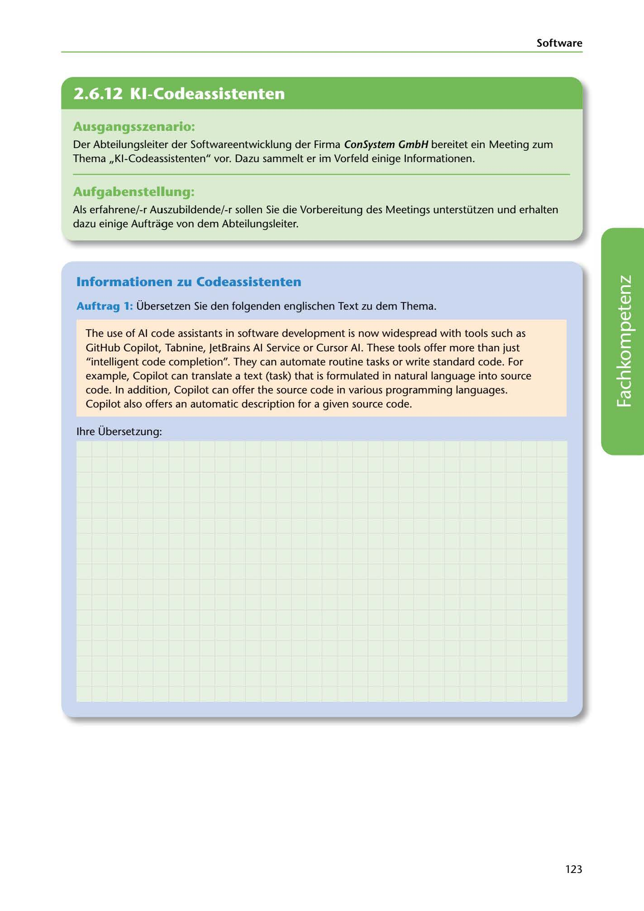

---
## Page 125
---

Software

<!-- IMAGE: page-125-img-1.jpeg - TODO: Add description -->

**[VISUAL: CONSYSTEM GMBH SCENARIO HEADER]**
Header image for the ConSystem GmbH AI code assistants meeting preparation scenario.

## Ausgangsszenario:

Der Abteilungsleiter der Softwareentwicklung der Firma ConSystem GmbH bereitet ein Meeting zum Thema ,,KI-Codeassistenten" vor. Dazu sammelt er im Vorfeld einige lnformationen.

## Aufgabenstellung:

Als erfahrene/-r Auszubildende/-r sallen Sie die Vorbereitung des Meetings unterstützen und erhalten dazu einige Auftrage van dem Abteilungsleiter.

## lnformationen zu Codeassistenten

Auftrag 1: Übersetzen Sie den folgenden englischen Text zu dem Thema.

The use of Al code assistants in software development is now widespread with tools such as GitHub Copilot, Tabnine, JetBrains Al Service or Cursor Al. These tools offer more than just "intelligent code completion". They can automate routine tasks or write standard code. Far example, Copilot can translate a text (task) that is formulated in natural language into source code. In addition, Copilot can offer the source code in various programming languages. Copilot also offers an automatic description far a given source code.

lhre Übersetzung:

**[VISUAL: ANSWER SPACE]**
Blank lined area for students to provide their German translation of the English text about AI code assistants (GitHub Copilot, Tabnine, JetBrains AI Service, Cursor AI).

123
