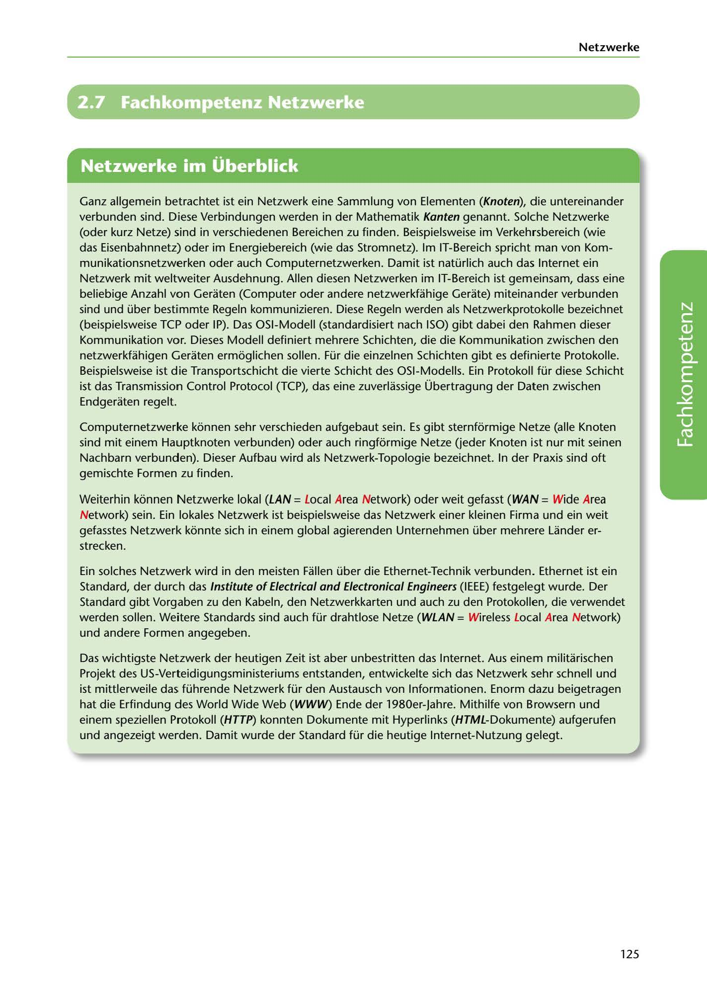

---
## Page 127
---

Netzwerke

# 2.7 Fachkompetenz Netzwerke

<!-- IMAGE: page-127-img-1.jpeg - TODO: Add description -->

**[VISUAL: NETWORK SECTION HEADER]**
Chapter header image for "2.7 Fachkompetenz Netzwerke" (Professional Competency in Networks) section, featuring network infrastructure and connectivity graphics.

Ganz allgemein betrachtet ist ein Netzwerk eine Sammlung von Elementen (Knoten), die untereinander verbunden sind. Diese Verbindungen werden in der Mathematik Kanten genannt. Solche Netzwerke (oder kurz Netze) sind in verschiedenen Bereichen zu finden. Beispielsweise im Verkehrsbereich (wie das Eisenbahnnetz) oder im Energiebereich (wie das Stromnetz). lm IT-Bereich spricht man von Kom- munikationsnetzwerken oder auch Computernetzwerken. Damit ist natürlich auch das Internet ein Netzwerk mit weltweiter Ausdehnung. Allen diesen Netzwerken im IT-Bereich ist gemeinsam, dass eine beliebige Anzahl von Geraten (Computer oder andere netzwerkfahige Gerate) miteinander verbunden sind und über bestiimmte Regeln kommunizieren. Diese Regeln werden als Netzwerkprotokolle bezeichnet (beispielsweise TCP oder IP). Das OSI-Modell (standardisiert nach ISO) gibt dabei den Rahmen dieser Kommunikation vor. Dieses Modell definiert mehrere Schichten, die die Kommunikation zwischen den netzwerkfahigen Geraten ermoglichen sallen. Für die einzelnen Schichten gibt es definierte Protokolle. Beispielsweise ist die Transportschicht die vierte Schicht des OSI-Modells. Ein Protokoll für diese Schicht ist das Transmission Control Protocol (TCP), das eine zuverlassige Übertragung der Daten zwischen Endgeraten regelt.

Computernetzwerke konnen sehr verschieden aufgebaut sein. Es gibt sternformige Netze (alle Knoten sind mit einem Hauptknoten verbunden) oder auch ringformige Netze (jeder Knoten ist nur mit seinen Nachbarn verbunden). Dieser Aufbau wird als Netzwerk-Topologie bezeichnet. In der Praxis sind oft gemischte Formen zu finden.

**[VISUAL: NETWORK TOPOLOGY DIAGRAMS]**
Diagrams showing various network topologies (star topology, ring topology, bus topology) and network types (LAN vs WAN), illustrating how nodes connect and communicate through different structures.

Weiterhin konnen Netzwerke lokal (LAN = Local Area Network) oder weit gefasst (WAN = Wide Area

Network) sein. Ein lokales Netzwerk ist beispielsweise das Netzwerk einer kleinen Firma und ein weit gefasstes Netzwerk konnte sich in einem global agierenden Unternehmen über mehrere Lander er- strecken.

Ein solches Netzwerk wird in den meisten Fallen über die Ethernet-Technik verbunden. Ethernet ist ein Standard, der durch das lnstitute of Electrical and Electronical Engineers (IEEE) festgelegt wurde. Der Standard gibt Vorgaben zu den Kabeln, den Netzwerkkarten und auch zu den Protokollen, die verwendet werden sallen. Weitere Standards sind auch für drahtlose Netze (WLAN = Wireless Local Area Network) und andere Formen angegeben.

Das wichtigste Netzwerk der heutigen Zeit ist aber unbestritten das Internet. Aus einem militarischen Projekt des US-Verteidigungsministeriums entstanden, entwickelte sich das Netzwerk sehr schnell und ist mittlerweile das führende Netzwerk für den Austausch von lnformationen. Enorm dazu beigetragen hat die Erfindung des World Wide Web (WWW) Ende der 1980er-Jahre. Mithilfe von Browsern und einem speziellen Protokoll (HTTP) konnten Dokumente mit Hyperlinks (HTML-Dokumente) aufgerufen und angezeigt werden. Damit wurde der Standard für die heutige lnternet-Nutzung gelegt.

125
