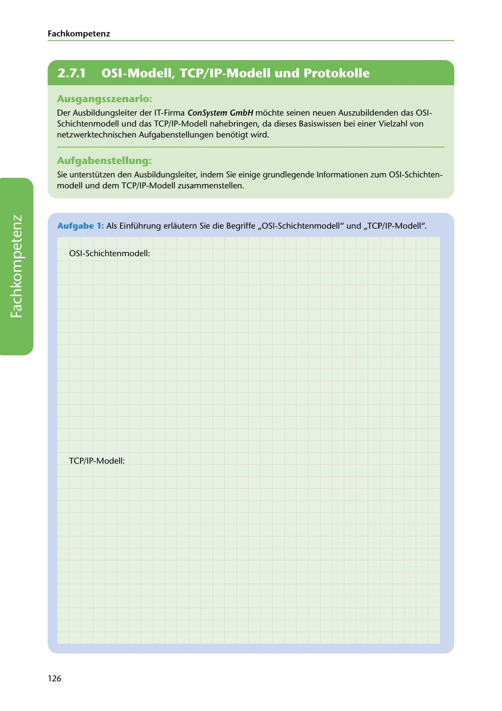

---
## Page 128
---

Fach kom petenz

# 2.7.1

# 0SI-Modell, TCP/IP-Modell und Protokolle

## Ausgangsszenario:

Der Ausbildungsleiter der IT-Firma ConSystem GmbH mochte seinen neuen Auszubildenden das 0SI- Schichtenmodell und das TCP/IP-Modell nahebringen, da dieses Basiswissen bei einer Vielzahl von netzwerktechnischen Aufgabenstellungen benotigt wird.

## Aufgabenstellung:

Sie unterstützen den Ausbildungsleiter, indem Sie einige grundlegende lnformationen zum 0SI-Schichten- modell und dem TCP/IP-Modell zusammenstellen.

Aufgabe 1: Als Einführung erlautern Sie die Begriffe ,,0 SI-Schichtenmodell" und ,,TCP/ IP-Modell".

0SI-Schichtenmodell:

<!-- IMAGE: page-128-img-1.jpeg - TODO: Add description -->

TCP/IP-Modell:

126
