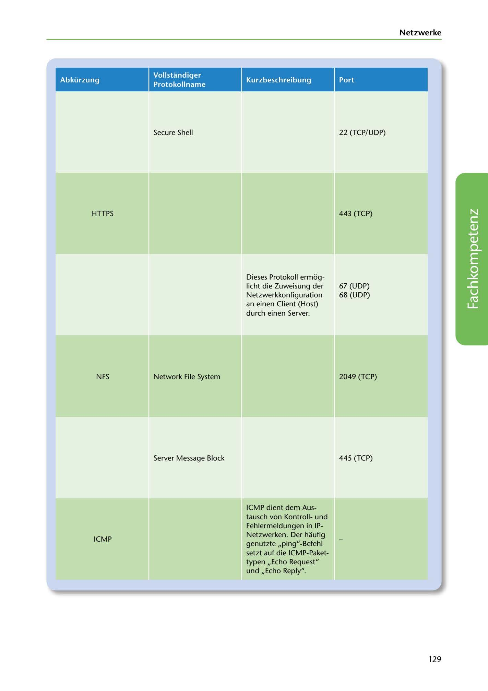

---
## Page 131
---

Netzwerke

Abkürzung

Kurzbeschreibung

Port

Vollstandiger Protokollname

Secure Shell

22 (TCP/ UDP)

HTTPS

443 (TCP)

67 (UDP) 68 (UDP)

Dieses Protokoll ermog- licht die Zuweisung der Netzwerkkonfiguration an einen Client (Host) durch einen Server.

<!-- IMAGE: page-131-img-1.jpeg - TODO: Add description -->

NFS

Network File System

2049 (TCP)

Server Message Block

445 (TCP)

ICMP

ICMP dient dem Aus- tausch von Kontrollund Fehlermeldungen in IP- Netzwerken. Der haufig genutzte ,,ping"-Befehl setzt auf die ICMP-Paket- typen ,,Echo Request" und ,,Echo Reply".

129
