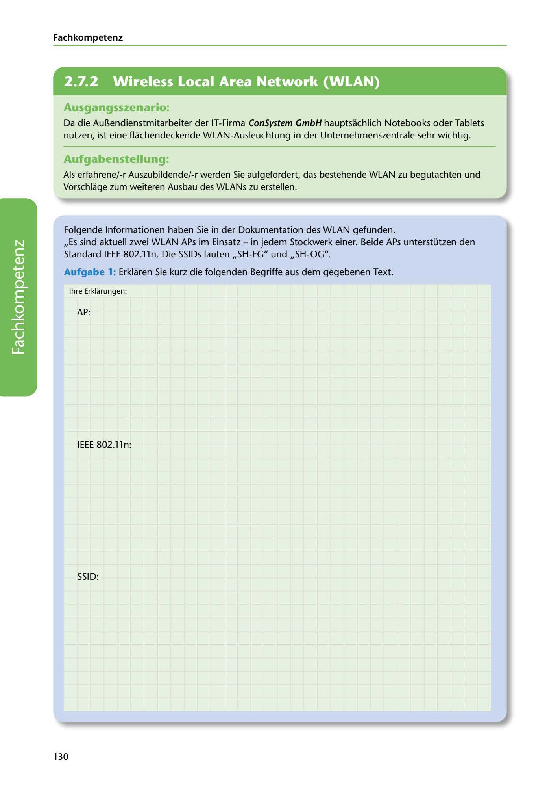

---
## Page 132
---

Fach kom petenz

<!-- IMAGE: page-132-img-1.jpeg - TODO: Add description -->

**[VISUAL: CONSYSTEM GMBH SCENARIO HEADER]**
Header image for the ConSystem GmbH WLAN assessment and expansion scenario.

## Ausgangsszenario:

Da die Au~endienstmitarbeiter der IT-Firma ConSystem GmbH hauptsachlich Notebooks oder Tablets nutzen, ist eine flachendeckende WLAN-Ausleuchtung in der Unternehmenszentrale sehr wichtig.

## Aufgabenstellung.

Als erfahrene/-r Auszubildende/-r werden Sie aufgefordert, das bestehende WLAN zu begutachten und Vorschlage zum weiteren Ausbau des WLANs zu erstellen.

Folgende lnformationen haben Sie in der Dokumentation des WLAN gefunden. ,,Es sind aktuell zwei WLAN APs im Einsatz - in jedem Stockwerk einer. Beide APs unterstützen den Standard IEEE 802.lln. Die SSIDs lauten ,,SH-EG" und ,,SH-OG".

Aufgabe 1: Erklaren Sie kurz die folgenden Begriffe aus dem gegebenen Text.

lhre Erklarungen:

AP:

**[VISUAL: ANSWER SPACE]**
Blank lined areas for students to explain WLAN terminology: AP (Access Point), IEEE 802.11n standard, and SSID.

IEEE 802.lln:

SSID:

130
