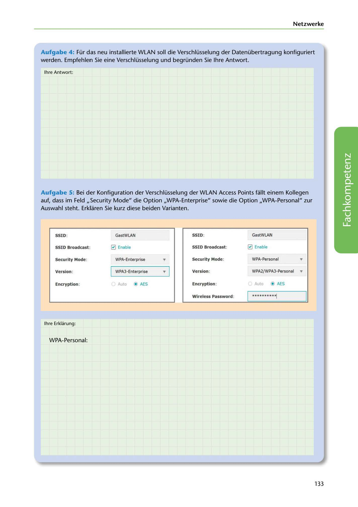

---
## Page 135
---

Netzwerke

Aufgabe 4: Für das neu installierte WLAN soll die Verschlüsselung der Datenübertragung konfiguriert werden. Empfehlen Sie eine Verschlüsselung und begründen Sie lhre Antwort.

lhre Antwort:

Aufgabe S: Bei der Konfiguration der Verschlüsselung der WLAN Access Points füllt einem Kollegen auf, dass im Feld ,,Security Mode" die Option ,,WPA-Enterprise" sowie die Option ,,WPA-Personal" zur Auswahl steht. Erklaren Sie kurz diese beiden Varianten.

### SSID:

### SSID:

### GastWLAN

GastWLAN

### SSID Broadcast:

### SSID Broadcast:

0 Enable 0 Enable

<!-- IMAGE: page-135-img-1.jpeg - TODO: Add description -->

### Security Mode:

### Security Mode:

WPA·Enterprise ... WPA-Personal ...

### Version:

### Version:

WPA3-Enterprise ... 1 WPA2/WPA3-Personal ...

### Encryption:

## Auto • AES

### Encryption:

Auto • AES

### Wireless Password:

*********~

lhre Erklarung:

WPA-Personal:

133
