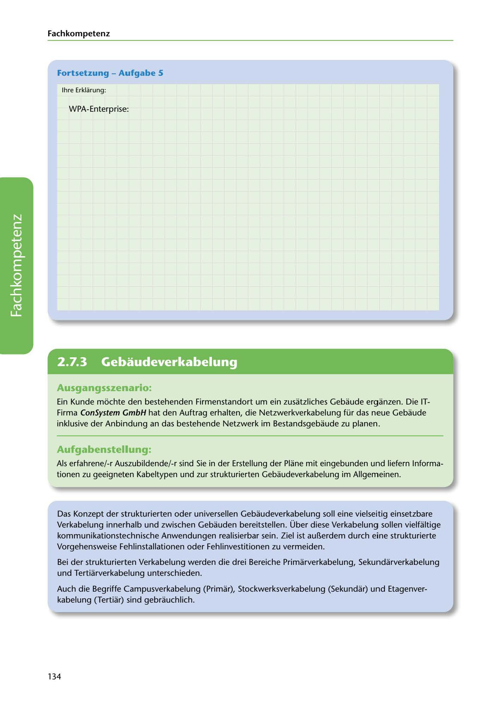

---
## Page 136
---

Fach kom petenz

### Fortsetzung - Aufgabe 5

lhre Erklarung:

WPA-Enterprise:

<!-- IMAGE: page-136-img-1.jpeg - TODO: Add description -->

**[VISUAL: ANSWER SPACE AND SCENARIO HEADER]**
Blank area for WPA-Enterprise explanation, followed by a new scenario header for the ConSystem GmbH structured cabling exercise.

## Ausgangsszenario:

Ein Kunde mochte den bestehenden Firmenstandort um ein zusatzliches Gebaude erganzen. Die IT- Firma ConSystem GmbH hat den Auftrag erhalten, die Netzwerkverkabelung für das neue Gebaude inklusive der Anbindung andas bestehende Netzwerk im Bestandsgebaude zu planen.

## Aufgabenstellung:

Als erfahrene/-r Auszubildende/-r sind Sie in der Erstellung der Plane mit eingebunden und liefern lnforma- tionen zu geeigneten Kabeltypen und zur strukturierten Gebaudeverkabelung im Allgemeinen.

Das Konzept der strukturierten oder universellen Gebaudeverkabelung soll eine vielseitig einsetzbare Verkabelung innerhalb und zwischen Gebauden bereitstellen. Über diese Verkabelung sollen vielfültige

kommunikationstechnische Anwendungen realisierbar sein. Ziel ist auBerdem durch eine strukturierte Vorgehensweise Fehlinstallationen oder Fehlinvestitionen zu vermeiden.

Bei der strukturierten Verkabelung werden die drei Bereiche Primarverkabelung, Sekundarverkabelung und Tertiarverkabelung unterschieden.

Auch die Begriffe Campusverkabelung (Primar), Stockwerksverkabelung (Sekundar) und Etagenver-

kabelung (Tertiar) sind gebrauchlich.

134
