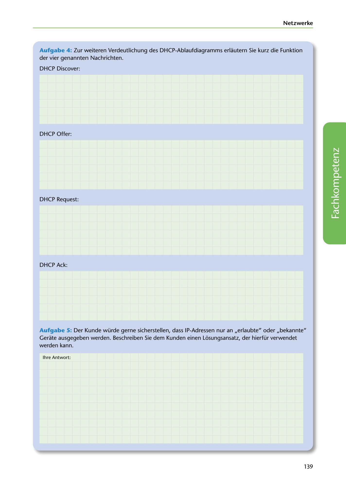

---
## Page 141
---

Netzwerke

Aufgabe 4: Zur weiteren Verdeutlichung des DHCP-Ablaufdiagramms erlautern Sie kurz die Funktion der vier genannten Nachrichten.

DHCP Discover:

DHCP Offer:

DHCP Request:

<!-- IMAGE: page-141-img-1.jpeg - TODO: Add description -->

DHCP Ack:

Aufgabe 5: Der Kunde würde gerne sicherstellen, dass IP-Adressen nur an ,,erlaubte" oder ,,bekannte" Gerate ausgegeben werden. Beschreiben Sie dem Kunden einen Losungsansatz, der hierfür verwendet werden kann.

lhre Antwort:

139
