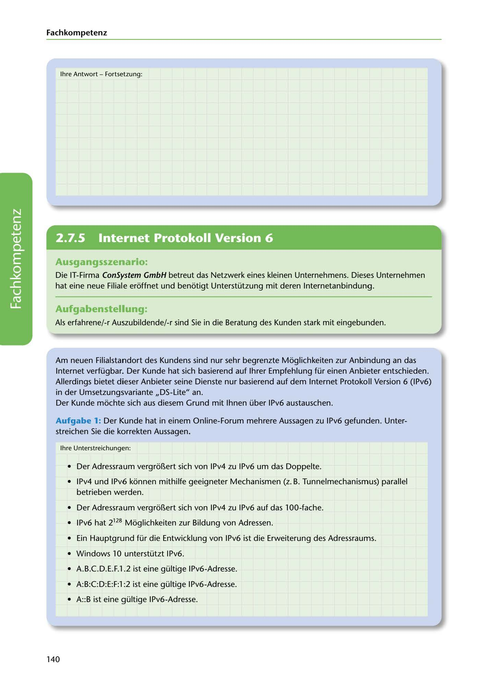

---
## Page 142
---

Fach kom petenz

lhre Antwort - Fortsetzung:

<!-- IMAGE: page-142-img-1.jpeg - TODO: Add description -->

**[VISUAL: ANSWER CONTINUATION SPACE]**
Continuation of answer space from previous page.

## Ausgangsszenario:

Die IT-Firma ConSystem GmbH betreut das Netzwerk eines kleinen Unternehmens. Dieses Unternehmen hat eine neue Filiale eroffnet und benotigt Unterstützung mit deren lnternetanbindung.

## Aufgabenstellung.

Als erfahrene/-r Auszubildende/-r sind Sie in die Beratung des Kunden stark mit eingebunden.

**[VISUAL: CONSYSTEM GMBH SCENARIO HEADER]**
Header image for the ConSystem GmbH IPv6 consulting scenario.

Am neuen Filialstandort des Kundens sind nur sehr begrenzte Moglichkeiten zur Anbindung an das

Internet verfügbar. Der Kunde hat sich basierend auf lhrer Empfehlung für einen Anbieter entschieden. Allerdings bietet dieser Anbieter seine Dienste nur basierend auf dem Internet Protokoll Version 6 (IPv6) in der Umsetzungsvariante ,,OS-Lite" an. Der Kunde mochte sich aus diesem Grund mit lhnen über IPv6 austauschen.

Aufgabe 1: Der Kunde hat in einem Online-Forum mehrere Aussagen zu IPv6 gefunden. Unter- streichen Sie die korrekten Aussagen.

lhre Unterstreichungen:

• Der Adressraum vergro~ert sich von f Pv4 zu IPv6 um das Doppelte.

• IPv4 und IPv6 konnen mithilfe geeigneter Mechanismen (z. B. Tunnelmechanismus) parallel betrieben werden.

• Der Adressraum vergro~ert sich von IPv4 zu IPv6 auf das 100-fache.

• IPv6 hat 2128 Moglichkeiten zur Bildung von Adressen.

• Ein Hauptgrund für die Entw icklung von IPv6 ist die Erweiterung des Adressraums.

• Windows 10 unterstützt f Pv6.

• A.B.C.D.E.F.1.2 ist eine gültige IPv6-Adresse.

• A:B:C:D:E:F:l :2 ist eine gültige IPv6-Adresse.

• A::B ist eine gültige IPv6-Adresse.

140
