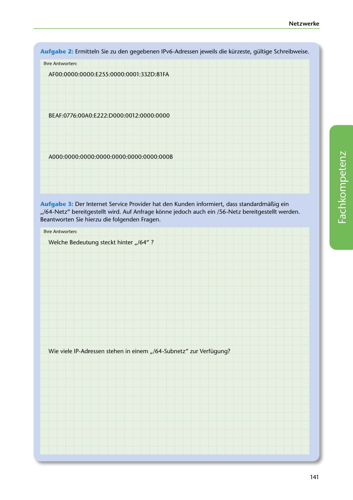

---
## Page 143
---

### Netzwerke

Aufgabe 2: Ermitteln Sie zu den gegebenen IPv6-Adressen jeweils die kürzeste, gültige Schreibweise.

lhre Antworten:

AFOO:OOOO:OOOO:E255:0000:0001 :332D:81 FA

BEAF:0776:00AO: E222: D000:0012:0000:0000

A000:0000:0000:0000:0000:0000:0000:000B

Aufgabe 3: Der Internet Service Provider hat den Kunden informiert, dass standardma~ig ein

,,/64-Netz" bereitgestellt wird. Auf Anfrage konne jedoch auch ein /56-Netz bereitgestellt werden. Beantworten Sie hierzu die folgenden Fragen.

lhre Antworten:

Welche Bedeutung steckt hinter ,,/64" ?

<!-- IMAGE: page-143-img-1.jpeg - TODO: Add description -->

Wie viele IP-Adressen stehen in einem ,,/64-Subnetz" zur Verfügung?

### 141
