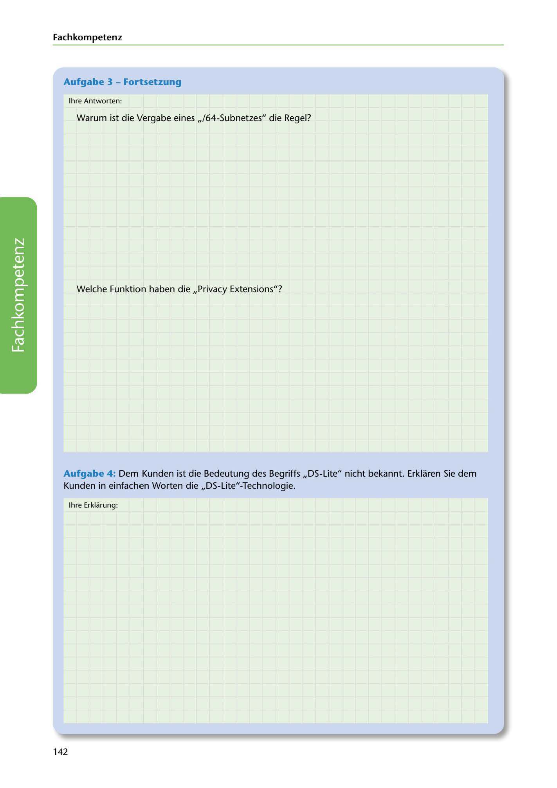

---
## Page 144
---

### Fach kom petenz

### Aufgabe 3 - Fortsetzung

lhre Antworten:

Warum ist die Vergabe eines ,,/64-Subnetzes" die Regel?

Welche Funktion haben die ,,Privacy Extensions"?

<!-- IMAGE: page-144-img-1.jpeg - TODO: Add description -->

Aufgabe 4 : Dem Kunden ist die Bedeutung des Begriffs ,,OS-Lite" nicht bekannt. Erklaren Sie dem Kunden in einfachen Worten die ,,DS-Lite"-Technologie.

lhre Erklarung:

142
