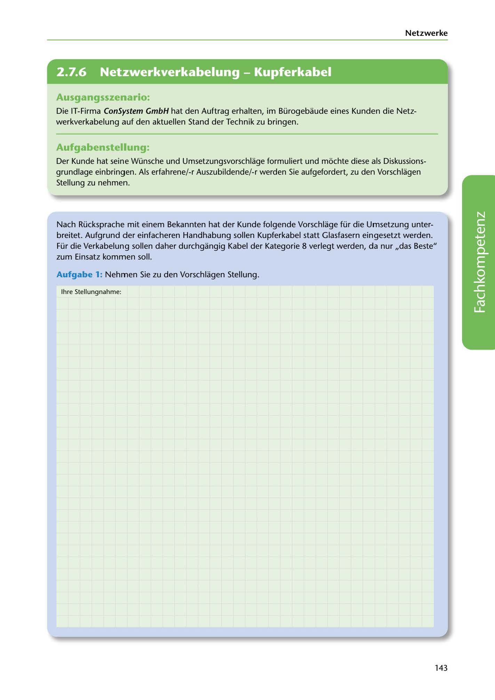

---
## Page 145
---

Netzwerke

<!-- IMAGE: page-145-img-1.jpeg - TODO: Add description -->

**[VISUAL: CONSYSTEM GMBH SCENARIO HEADER]**
Header image for the ConSystem GmbH network cabling modernization scenario.

## Ausgangsszenario:

Die IT-Firma ConSystem GmbH hat den Auftrag erhalten, im Bürogebaude eines Kunden die Netz- werkverkabelung auf den aktuellen Stand der Technik zu bringen.

## Aufgabenstellung:

Der Kunde hat seine Wünsche und Umsetzungsvorschlage formuliert und móchte diese als Diskussions- grundlage einbringen. Als erfahrene/-r Auszubildende/-r werden Sie aufgefordert, zu den Vorschlagen Stellung zu nehmen.

Nach Rücksprache mit einem Bekannten hat der Kunde folgende Vorschlage für die Umsetzung unter- breitet. Aufgrund der einfacheren Handhabung sollen Kupferkabel statt Glasfasern eingesetzt werden. Für die Verkabelung sollen daher durchgangig Kabel der Kategorie 8 verlegt werden, da nur ,,das Beste" zum Einsatz kommen soll.

### Aufgabe 1: Nehmen Sie zu den Vorschlagen Stellung.

lhre Stellungnahme:

**[VISUAL: ANSWER SPACE]**
Blank lined area for students to provide their assessment of the customer's cabling proposals (copper vs fiber optic, Category 8 cabling).

143
