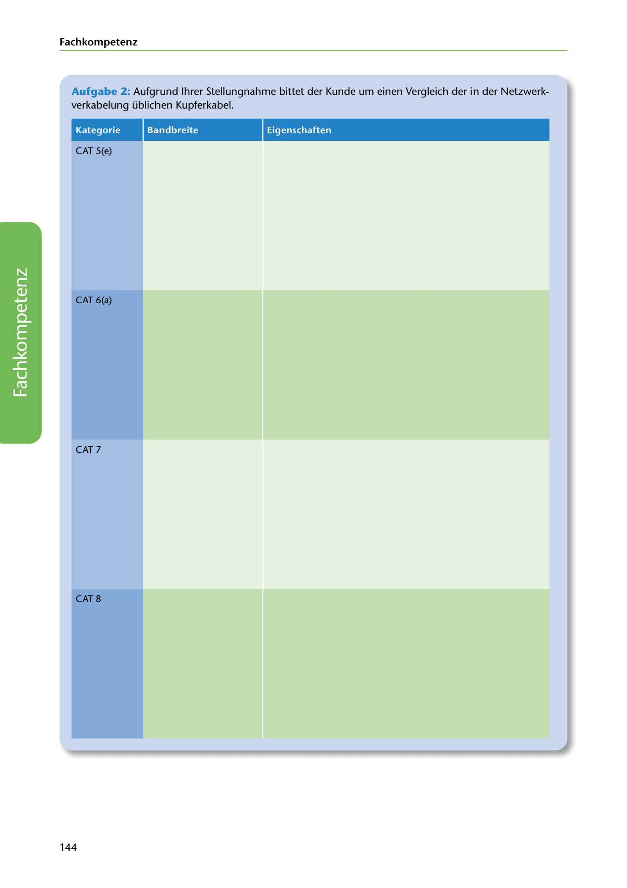

---
## Page 146
---

Fach kom petenz

Aufgabe 2: Aufgrund lhrer Stellungnahme bittet der Kunde um einen Vergleich der in der Netzwerk- verkabelung üblichen Kupferkabel.

Kategorie Bandbreite Eigenschaften

CAT 5(e)

### CAT 6(a)

<!-- IMAGE: page-146-img-1.jpeg - TODO: Add description -->

CAT7

### CAT8

144
