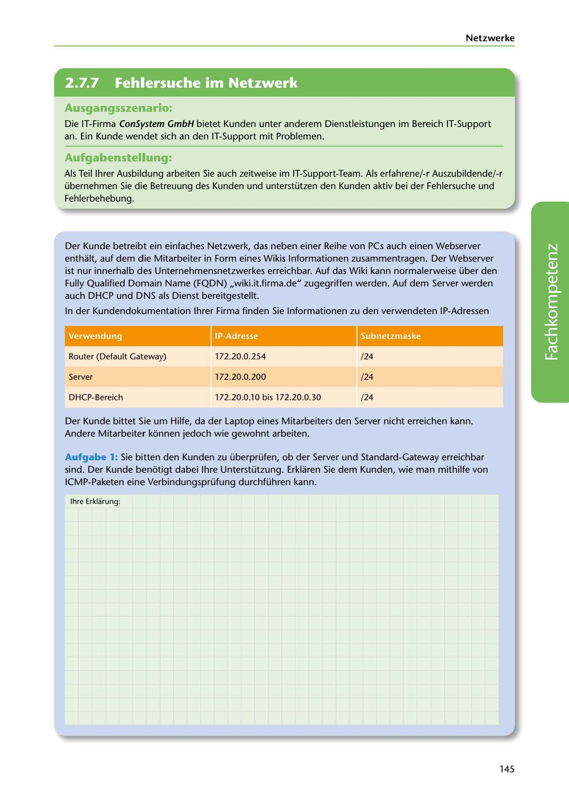

---
## Page 147
---

Netzwerke

<!-- IMAGE: page-147-img-1.jpeg - TODO: Add description -->

**[VISUAL: CONSYSTEM GMBH SCENARIO HEADER]**
Header image for the ConSystem GmbH IT support troubleshooting scenario.

## Ausgangsszenario:

Die IT-Firma ConSystem GmbH bietet Kunden unter anderem Dienstleistungen im Bereich IT-Support an. Ein Kunde wendet sich an den IT-Support mit Problemen.

## Aufgabenstellung:

Als Teil lhrer Ausbildung arbeiten Sie auch zeitweise im IT-Support-Team. Als erfahrene/-r Auszubildende/-r übernehmen Sie die Betreuung des Kunden und unterstützen den Kunden aktiv bei der Fehlersuche und Fehlerbehebung.

**[VISUAL: NETWORK IP ADDRESS TABLE]**
Reference table showing IP address assignments for the customer network:
| Device | IP Address | Subnet |
|--------|-----------|--------|
| Router (Default Gateway) | 172.20.0.254 | /24 |
| Server | 172.20.0.200 | /24 |
| DHCP Range | 172.20.0.10 - 172.20.0.30 | /24 |

Der Kunde betreibt ein einfaches Netzwerk, das neben einer Reihe von PCs auch einen Webserver enthalt, auf dem die Mitarbeiter in Form eines Wikis lnformationen zusammentragen. Der Webserver ist nur innerhalb des Unternehmensnetzwerkes erreichbar. Auf das Wiki kann normalerweise über den Fully Qualified Domain Name (FQDN) ,,wiki.it.firma.de" zugegriffen werden. Auf dem Server werden auch DHCP und DNS als Dienst bereitgestellt.

In der Kundendokumentation lhrer Firma finden Sie lnformationen zu den verwendeten IP-Adressen

# . . -

Router (Default Gateway)

172.20.0.254

/24

Server

172.20.0.200

/24

DHCP-Bereich

172.20.0.10 bis 172.20.0.30

/24

**[VISUAL: NETWORK IP ADDRESS TABLE]**
Reference table showing IP address assignments for the customer network:
| Device | IP Address | Subnet |
|--------|-----------|--------|
| Router (Default Gateway) | 172.20.0.254 | /24 |
| Server | 172.20.0.200 | /24 |
| DHCP Range | 172.20.0.10 - 172.20.0.30 | /24 |

Der Kunde bittet Sie um Hilfe, da der Laptop eines Mitarbeiters den Server nicht erreichen kann. Andere Mitarbeiter kónnen jedoch wie gewohnt arbeiten.

Aufgabe 1: Sie bitten den Kunden zu überprüfen, ob der Server und Standard-Gateway erreichbar sind. Der Kunde benótigt dabei lhre Unterstützung. Erklaren Sie dem Kunden, wie man mithilfe von ICMP-Paketen eine Verbindungsprüfung durchführen kann.

lhre Erklarung:

145
