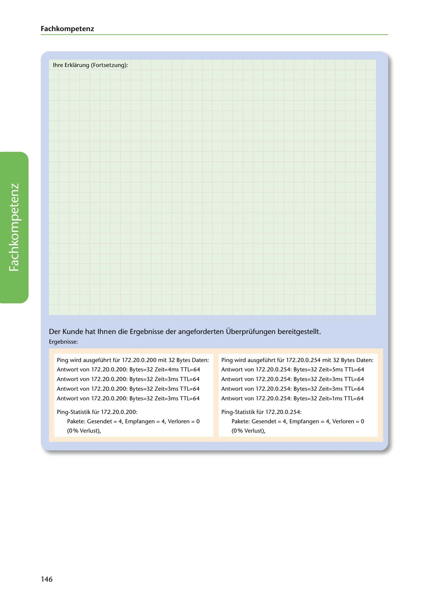

---
## Page 148
---

### Fach kom petenz

lhre Erklarung (Fortsetzung):

<!-- IMAGE: page-148-img-1.jpeg - TODO: Add description -->

Der Kunde hat lhnen die Ergebnisse der angeforderten Überprüfungen bereitgestellt.

Ergebnisse:

Ping wird ausgeführt für 172.20.0.200 mit 32 Bytes Daten:

Ping wird ausgeführt für 172.20.0.254 mit 32 Bytes Daten:

Antwort von 172.20.0.200: Bytes=32 Zeit=4ms TTL=64

Antwort von 172.20.0.254: Bytes=32 Zeit=5ms TTL=64

Antwort von 172.20.0.200: Bytes=32 Zeit=3ms TTL=64

Antwort von 172.20.0.254: Bytes=32 Zeit=3ms TTL=64

Antwort von 172.20.0.200: Bytes=32 Zeit=3ms TTL=64

Antwort von 172.20.0.254: Bytes=32 Zeit=3ms TTL=64

Antwort von 172.20.0.200: Bytes=32 Zeit=3ms TTL=64

Antwort von 172.20.0.254: Bytes=32 Zeit=l ms TTL=64

Ping-Statistik für 172.20.0.200:

Ping-Statistik für 172.20.0.254:

Pakete: Gesendet = 4, Empfangen = 4, Verloren = O

Pakete: Gesendet = 4, Empfangen = 4, Verloren = O

(0% Verlust),

(0% Verlust),

### 146
