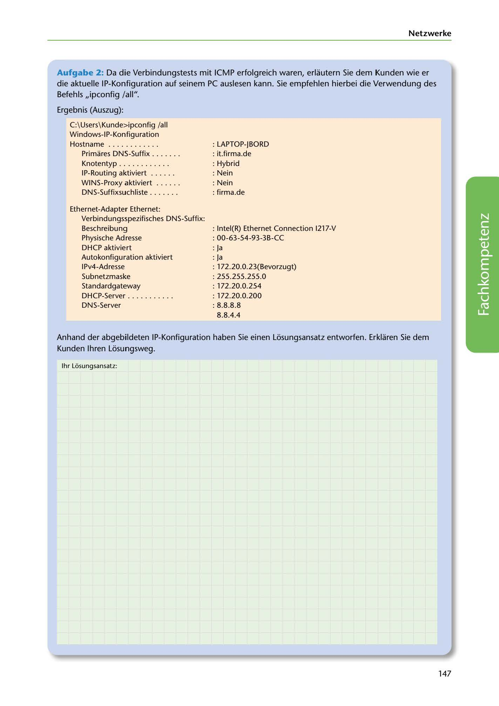

---
## Page 149
---

### Netzwerke

Aufgabe 2: Da die Verbindungstests mit ICMP erfolgreich waren, erlautern Sie dem Kunden wie er die aktuelle IP-Konfiguration auf seinem PC auslesen kann. Sie empfehlen hierbei die Verwendung des Befehls ,,ipconfig /all".

Ergebnis (Auszug):

C:\ Users\ Kunde>ipconfig /ali Windows-I P-Konfiguration

Hostname . .. . .. . . .. . . Primares DNS-Suffix . . . .. . . Knotentyp . . .. . .. . . .. . IP-Routing aktiviert . .. .. . WINS-Proxy aktiviert . . .. . . DNS-Suffixsuchliste .. . .. . .

: LAPTOP-JBORD : it.firma.de : Hybrid : Nein : Nein : firma.de

Ethernet-Adapter Ethernet: Verbindungsspezifisches DNS-Suffix: Beschreibung Physische Ad resse DHCP aktiviert Autokonfigu ration aktiviert

1Pv4-Adresse Subnetzmaske Standardgateway DHCP-Server . . .. .. . .. . . DNS-Server

: lntel(R) Ethernet Connection I217-V : 00-63-54-93-3B-CC : Ja : Ja : 172.20.0.23(Bevorzugt) : 255.255.255.0 : 172.20.0.254 : 172.20.0.200 : 8.8.8.8 8.8.4.4

<!-- IMAGE: page-149-img-1.jpeg - TODO: Add description -->

Anhand der abgebildeten IP-Konfiguration haben Sie einen Li::isungsansatz entworfen. Erklaren Sie dem Kunden lhren Li::isungsweg.

1hr Lósungsansatz:

147
