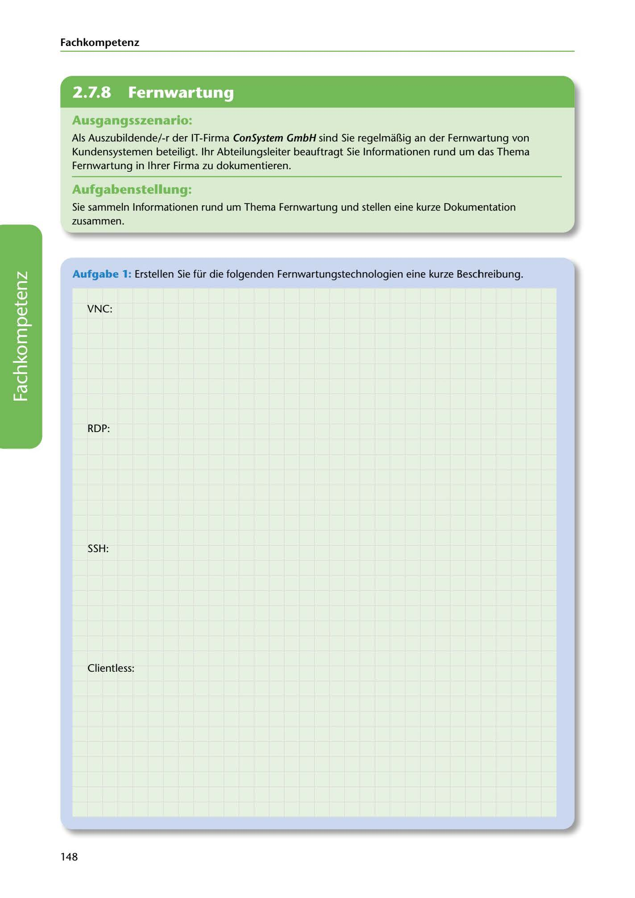

---
## Page 150
---

Fach kom petenz

<!-- IMAGE: page-150-img-1.jpeg - TODO: Add description -->

**[VISUAL: CONSYSTEM GMBH SCENARIO HEADER]**
Header image for the ConSystem GmbH remote maintenance (Fernwartung) documentation scenario.

## Ausgangsszenario:

Als Auszubildende/-r der IT-Firma ConSystem GmbH sind Sie regelmaBig an der Fernwartung von Kundensystemen beteiligt. 1hr Abteilungsleiter beauftragt Sie lnformationen rund um das Thema Fernwartung in lhrer Firma zu dokumentieren.

## Aufgabenstellung.

Sie sammeln lnformationen rund um Thema Fernwartung und stellen eine kurze Dokumentation zusammen.

Aufgabe 1: Erstellen Sie für die folgenden Fernwartungstechnologien eine kurze Beschreibung.

VNC:

RDP:

**[VISUAL: ANSWER SPACE]**
Blank lined areas for students to describe remote maintenance technologies: VNC, RDP, SSH, and Clientless solutions.

SSH:

Clientless:

148
