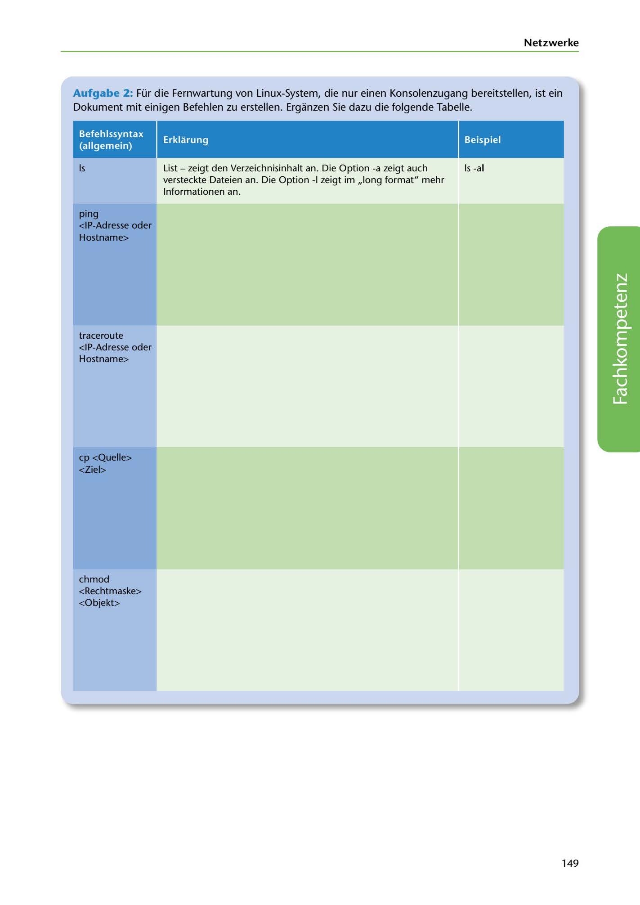

---
## Page 151
---

Netzwerke

Aufgabe 2: Für die Fernwartung von Linux-System, die nur einen Konsolenzugang bereitstellen, ist ein Dokument mit einigen Befehlen zu erstellen. Erganzen Sie dazu die folgende Tabelle.

### Erklarung

### Beispiel

### Befehlssyntax

### (allgemein)

### Is

Is -al

List - zeigt den Verzeichnisinhalt an. Die Option -a zeigt auch versteckte Dateien an. Die Option -1 zeigt im ,,long format" mehr

lnformationen an.

### ping

### <IP-Adresse oder

### Hostname>

traceroute <IP-Adresse oder Hostname>

<!-- IMAGE: page-151-img-1.jpeg - TODO: Add description -->

cp <Quelle> <Ziel>

chmod <Rechtmaske> <Objekt>

149
