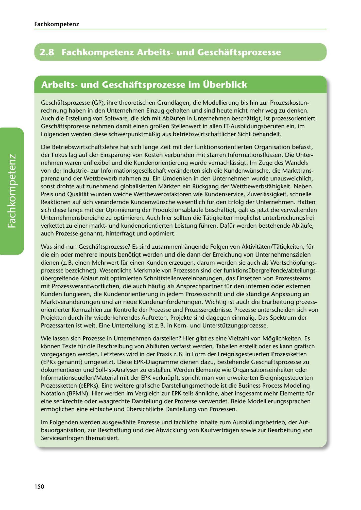

---
## Page 152
---

Fach kom petenz

# 2.8 Fachkompetenz Arbeitsund Geschaftsprozesse

<!-- IMAGE: page-152-img-1.jpeg - TODO: Add description -->

**[VISUAL: BUSINESS PROCESSES SECTION HEADER]**
Chapter header image for "2.8 Fachkompetenz Arbeits- und Geschäftsprozesse" (Professional Competency in Work and Business Processes) section, featuring business workflow and process graphics.

Geschaftsprozesse (GP), ihre theoretischen Grundlagen, die Modellierung bis hin zur Prozesskosten- rechnung haben in den Unternehmen Einzug gehalten und sind heute nicht mehr weg zu denken. Auch die Erstellung von Software, die sich mit Ablaufen in Unternehmen beschaftigt, ist prozessorientiert. Geschaftsprozesse nehmen damit einen gro~en Stellenwert in allen IT-Ausbildungsberufen ein, im Folgenden werden diese schwerpunktma~ig aus betriebswirtschaftlicher Sicht behandelt.

Die Betriebsw irtschaftslehre hat sich lange Zeit mit der funktionsorientierten Organisation befasst, der Fokus lag auf der Einsparung von Kosten verbunden mit starren lnformationsflüssen. Die Unter- nehmen waren unflexibel und die Kundenorientierung wurde vernachlassigt. lm Zuge des Wandels von der Industriezur lnformationsgesellschaft veranderten sich die Kundenwünsche, die Markttrans- parenz und der Wettbewerb nahmen zu. Ein Umdenken in den Unternehmen wurde unausweichlich, sonst drohte auf zunehmend globalisierten Markten ein Rückgang der Wettbewerbsfühigkeit. Neben Preis und Qualitat wurden weiche Wettbewerbsfaktoren wie Kundenservice, Zuverlassigkeit, schnelle Reaktionen auf sich verandernde Kundenwünsche wesentlich für den Erfolg der Unternehmen. Hatten sich diese lange mit der Optimierung der Produktionsablaufe beschaftigt, galt es jetzt die verwaltenden Unternehmensbereiche zu optimieren. Auch hier sollten die Tatigkeiten moglichst unterbrechungsfrei verkettet zu einer marktund kundenorientierten Leistung führen. Dafür werden bestehende Ablaufe, auch Prozesse genannt, hinterfragt und optimiert.

**[VISUAL: BUSINESS PROCESS EVOLUTION DIAGRAM]**
Diagram illustrating the evolution from function-oriented organization to process-oriented organization, showing how businesses moved from rigid structures to customer-focused, flexible processes.

Was sind nun Geschaftsprozesse? Es sind zusammenhangende Folgen von Aktivitaten/Tatigkeiten, für die ein oder mehrere lnputs benotigt werden und die dann der Erreichung van Unternehmenszielen dienen (z. B. einen Mehrwert für einen Kunden erzeugen, darum werden sie auch als Wertschopfungs- prozesse bezeichnet). Wesentliche Merkmale von Prozessen sind der funktionsübergreifende/abteilungs- übergreifende Ablauf mit optimierten Schnittstellenvereinbarungen, das Einsetzen von Prozessteams mit Prozessverantwortlichen, die auch haufig als Ansprechpartner für den internen oder externen Kunden fungieren, die Kundenorientierung in jedem Prozessschritt und die standige Anpassung an Marktveranderungen und an neue Kundenanforderungen. Wichtig ist auch die Erarbeitung prozess- orientierter Kennzahlen zur Kontrolle der Prozesse und Prozessergebnisse. Prozesse unterscheiden sich von

Projekten durch ihr wiederkehrendes Auftreten, Projekte sind dagegen einmalig. Das Spektrum der Prozessarten ist weit. Eine Unterteilung ist z. B. in Kernund Unterstützungsprozesse.

Wie lassen sich Prozesse in Unternehmen darstellen? Hier gibt es eine Vielzahl von Moglichkeiten. Es konnen Texte für die Beschreibung von Ablaufen verfasst werden, Tabellen erstellt oder es kann grafisch vorgegangen werden. Letzteres wird in der Praxis z. B. in Form der Ereignisgesteuerten Prozessketten (EPKs genannt) umgesetzt. Diese EPK-Diagramme dienen dazu, bestehende Geschaftsprozesse zu dokumentieren und Soll-lst-Analysen zu erstellen. Werden Elemente wie Organisationseinheiten oder lnformationsquellen/Material mit der EPK verknüpft, spricht man von erweiterten Ereignisgesteuerten Prozessketten (eEPKs). Eine weitere grafische Darstellungsmethode ist die Business Process Modeling Notation (BPMN). Hier werden im Vergleich zur EPK teils ahnliche, aber insgesamt mehr Elemente für eine senkrechte oder waagrechte Darstellung der Prozesse verwendet. Beide Modellierungssprachen ermoglichen eine einfache und übersichtliche Darstellung von Prozessen.

lm Folgenden werden ausgewahlte Prozesse und fachliche lnhalte zum Ausbildungsbetrieb, der Auf- bauorganisation, zur Beschaffung und der Abwicklung von Kaufvertragen sowie zur Bearbeitung von Serviceanfragen thematisiert.

150
