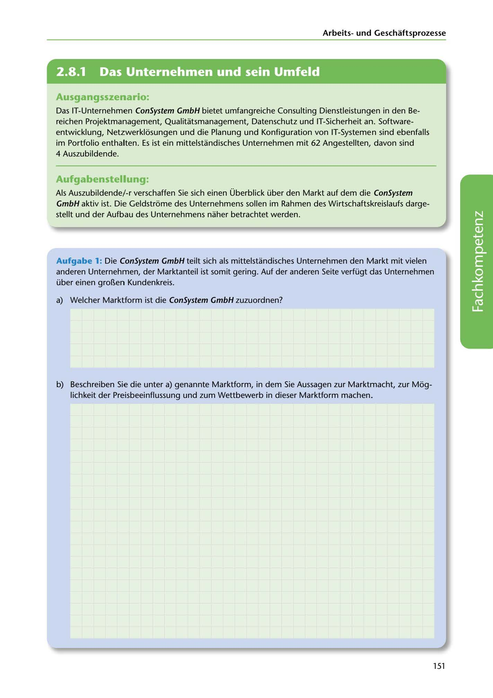

---
## Page 153
---

Arbeitsund Geschaftsprozesse

<!-- IMAGE: page-153-img-1.jpeg - TODO: Add description -->

**[VISUAL: CONSYSTEM GMBH SCENARIO HEADER]**
Header image for the ConSystem GmbH market analysis and organizational structure scenario.

## Ausgangsszenario:

### 4 Auszubildende.

Das IT-Unternehmen ConSystem GmbH bietet umfangreiche Consulting Dienstleistungen in den Be- reichen Projektmanagement, Qualitatsmanagement, Datenschutz und IT-Sicherheit an. Software- entwicklung, Netzwerklosungen und die Planung und Konfiguration van IT-Systemen sind ebenfalls im Portfolio enthalten. Es ist ein mittelstandisches Unternehmen mit 62 Angestellten, davon sind

## Aufgabenstellung:

Als Auszubildende/ -r verschaffen Sie sich einen Überblick über den Markt auf dem die ConSystem GmbH aktiv ist. Die Geldstrome des Unternehmens sollen im Rahmen des Wirtschaftskreislaufs darge- stellt und der Aufbau des Unternehmens naher betrachtet werden.

Aufgabe 1: Die ConSystem GmbH teilt sich als mittelstandisches Unternehmen den Markt mit vielen anderen Unternehmen, der Marktanteil ist somit gering. Auf der anderen Seite verfügt das Unternehmen über einen gro~en Kundenkreis.

### a) Welcher Marktform ist die ConSystem GmbH zuzuordnen?

**[VISUAL: ANSWER SPACE]**
Blank lined area for students to identify and describe the market form (Marktform) - likely Polypol (atomistic competition).

b) Beschreiben Sie die unter a) genannte Marktform, in dem Sie Aussagen zur Marktmacht, zur Mog-

lichkeit der Preisbeeinflussung und zum Wettbewerb in dieser Marktform machen.

151
