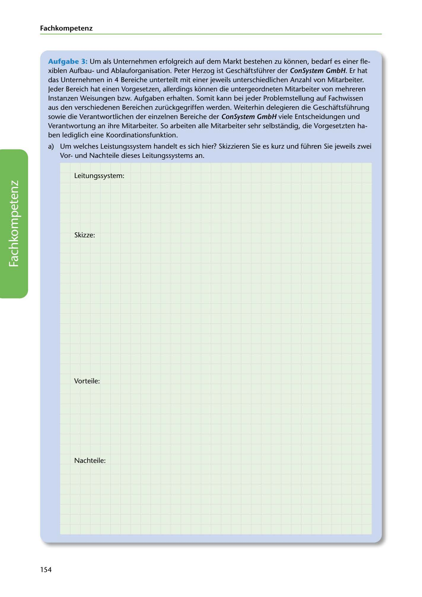

---
## Page 156
---

Fach kom petenz

Aufgabe 3: Um als Unternehmen erfolgreich auf dem Markt bestehen zu konnen, bedarf es einer fle- xiblen Aufbauund Ablauforganisation. Peter Herzog ist Geschaftsführer der ConSystem GmbH. Er hat das Unternehmen in 4 Bereiche unterteilt mit einer jeweils unterschiedlichen Anzahl von Mitarbeiter. Jeder Bereich hat einen Vorgesetzen, allerdings konnen die untergeordneten Mitarbeiter van mehreren lnstanzen Weisungen bzw. Aufgaben erhalten. Somit kann bei jeder Problemstellung auf Fachwissen aus den verschiedenen Bereichen zurückgegriffen werden. Weiterhin delegieren die Geschaftsführung sowie die Verantwortlichen der einzelnen Bereiche der ConSystem GmbH viele Entscheidungen und Verantwortung an ihre Mitarbeiter. So arbeiten alle Mitarbeiter sehr selbstandig, die Vorgesetzten ha-

ben lediglich eine Koordinationsfunktion.

a) Um welches Leistungssystem handelt es sich hier? Skizzieren Sie es kurz und führen Sie jeweils zwei Vorund Nachteile dieses Leitungssystems an.

Leitungssystem:

Skizze:

<!-- IMAGE: page-156-img-1.jpeg - TODO: Add description -->

Vorteile:

Nachteile:

154
