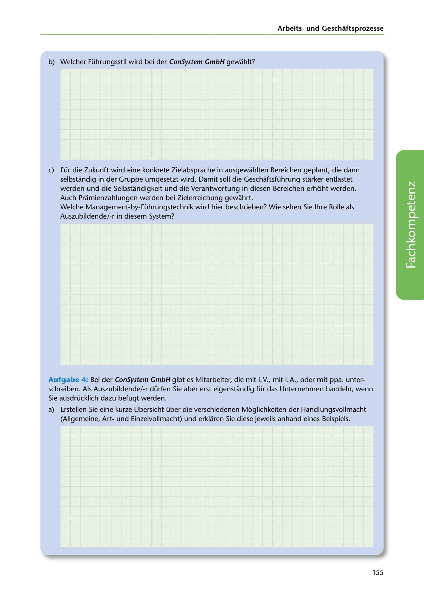

---
## Page 157
---

### Arbeitsund Geschaftsprozesse

b) Welcher Führungsstil wird bei der ConSystem GmbH gewahlt?

e) Für die Zukunft wird eine konkrete Zielabsprache in ausgewahlten Bereichen geplant, die dann

selbstandig in der Gruppe umgesetzt wird. Damit soll die Geschaftsführung starker entlastet werden und die Selbstandigkeit und die Verantwortung in diesen Bereichen erhoht werden. Auch Pramienzahlungen werden bei Zielerreichung gewahrt. Welche Management-by-Führungstechnik wird hier beschrieben? Wie sehen Sie lhre Rolle als Auszubildende/-r in diesem System?

<!-- IMAGE: page-157-img-1.jpeg - TODO: Add description -->

Aufgabe 4 : Bei der ConSystem GmbH gibt es Mitarbeiter, die mit i. V., mit i. A., oder mit ppa. unter- schreiben. Als Auszubildende/-r dürfen Sie aber erst eigenstandig für das Unternehmen handeln, wenn Sie ausdrücklich dazu befugt werden.

a) Erstellen Sie eine kurze Übersicht über die verschiedenen Moglichkeiten der Handlungsvollmacht

(Allgemeine, Artund Einzelvollmacht) und erklaren Sie diese jeweils anhand eines Beispiels.

155
