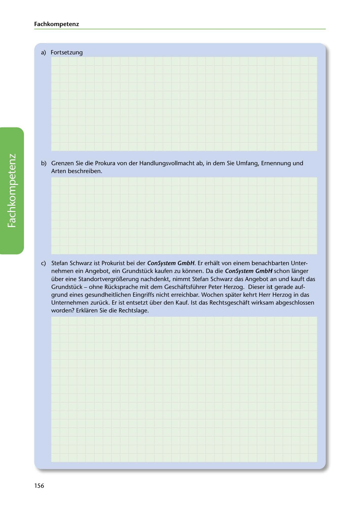

---
## Page 158
---

### Fach kom petenz

a) Fortsetzung

b) Grenzen Sie die Prokura von der Handlungsvollmacht ab, in dem Sie Umfang, Ernennung und

Arten beschreiben.

<!-- IMAGE: page-158-img-1.jpeg - TODO: Add description -->

e) Stefan Schwarz ist Prokurist bei der ConSystem GmbH. Er erhalt von einem benachbarten Unter- nehmen ein Angebot, ein Grundstück kaufen zu konnen. Da die ConSystem GmbH schon langer über eine Standortvergror..erung nachdenkt, nimmt Stefan Schwarz das Angebot an und kauft das Grundstück - ohne Rücksprache mit dem Geschaftsführer Peter Herzog. Dieser ist gerade auf- grund eines gesundheitlichen Eingriffs nicht erreichbar. Wochen spater kehrt Herr Herzog in das Unternehmen zurück. Er ist entsetzt über den Kauf. 1st das Rechtsgeschaft wirksam abgeschlossen worden? Erklaren Sie die Rechtslage.

156
