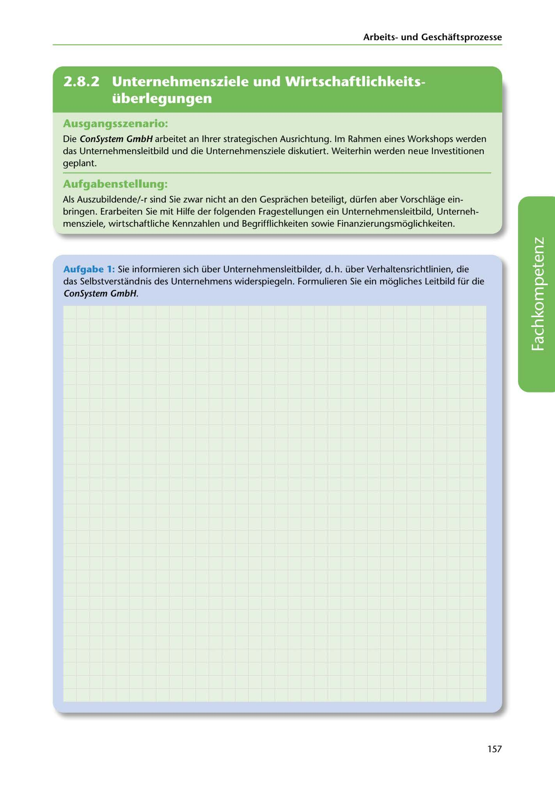

---
## Page 159
---

Arbeitsund Geschaftsprozesse

<!-- IMAGE: page-159-img-1.jpeg - TODO: Add description -->

**[VISUAL: CONSYSTEM GMBH SCENARIO HEADER]**
Header image for the ConSystem GmbH corporate strategy and mission statement workshop scenario.

## Ausgangsszenario:

Die ConSystem GmbH arbeitet an lhrer strategischen Ausrichtung. lm Rahmen eines Workshops werden das Unternehmensleitbild und die Unternehmensziele diskutiert. Weiterhin werden neue lnvestitionen geplant.

## Aufgabenstellung:

Als Auszubildende/-r sind Sie zwar nicht an den Gesprachen beteiligt, dürfen aber Vorschlage ein- bringen. Erarbeiten Sie mit Hilfe der folgenden Fragestellungen ein Unternehmensleitbild, Unterneh- mensziele, wirtschaftliche Kennzahlen und Begrifflichkeiten sowie Finanzierungsmoglichkeiten.

Aufgabe 1: Sie informieren sich über Unternehmensleitbilder, d. h. über Verhaltensrichtlinien, die das Selbstverstandnis des Unternehmens widerspiegeln. Formulieren Sie ein mogliches Leitbild für die ConSystem GmbH.

**[VISUAL: ANSWER SPACE]**
Blank lined area for students to formulate a company mission statement (Unternehmensleitbild) for ConSystem GmbH.

157
