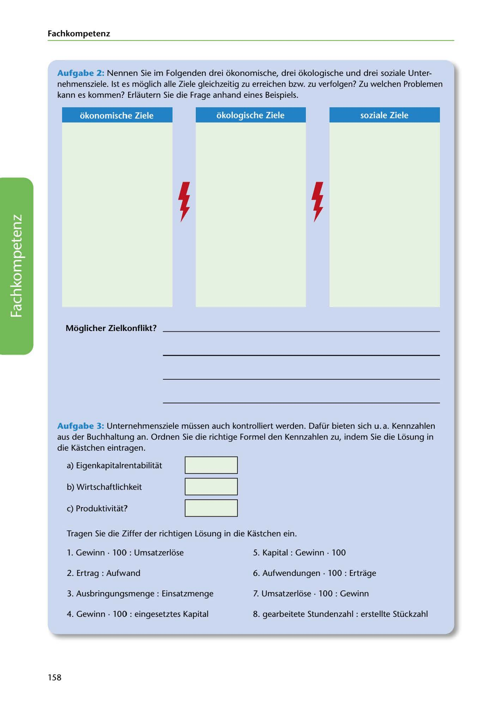

---
## Page 160
---

Fach kom petenz

Aufgabe 2: Nennen Sie im Folgenden drei ókonomische, drei ókologische und drei soziale Unter- nehmensziele. 1st es moglich alle Ziele gleichzeitig zu erreichen bzw. zu verfolgen? Zu welchen Problemen kann es kommen? Erlautern Sie die Frage anhand eines Beispiels.

okonomische Ziele okologische Ziele soziale Ziele

<!-- IMAGE: page-160-img-1.jpeg - TODO: Add description -->

**[VISUAL: THREE-PILLAR SUSTAINABILITY GOALS TABLE]**
Table with three columns for students to fill in economic goals (ökonomische Ziele), ecological goals (ökologische Ziele), and social goals (soziale Ziele) - representing the three pillars of corporate sustainability.

### Moglicher Zielkonflikt?

**[VISUAL: ANSWER SPACE]**
Blank lined area for students to discuss potential goal conflicts between the three sustainability dimensions and provide examples.

Aufgabe 3: Untemehmensziele müssen auch kontrolliert werden. Dafür bieten sich u. a. Kennzahlen aus der Buchhaltung an. Ordnen Sie die richtige Formel den Kennzahlen zu, indem Sie die Lósung in die Kastchen eintragen.

a) Eigenkapitalrentabilitat

b) Wirtschaftlichkeit

e) Produktivitat?

Tragen Sie die Ziffer der richtigen Lósung in die Kastchen ein.

### 1. Gewinn • 100 : Umsatzerlóse

5. Kapital : Gewinn • 100

2. Ertrag : Aufwand 6. Aufwendungen • 100 : Ertrage

3. Ausbringungsmenge : Einsatzmenge 7. Umsatzerlóse • 100 : Gewinn

4. Gewinn • 100: eingesetztes Kapital 8. gearbeitete Stundenzahl : erstellte Stückzahl

158
