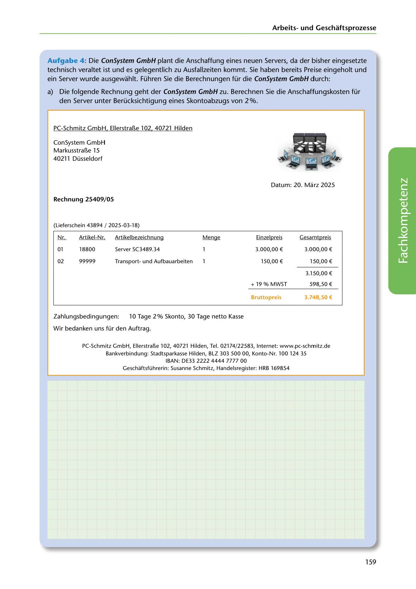

---
## Page 161
---

Arbeitsund Geschaft sprozesse

Aufgabe 4: Die ConSystem GmbH plant die Anschaffung eines neuen Servers, da der bisher eingesetzte technisch veraltet ist und es gelegentlich zu Ausfallzeiten kommt. Sie haben bereits Preise eingeholt und ein Server wurde ausgewahlt. Führen Sie die Berechnungen für die ConSystem GmbH durch:

a) Die folgende Rechnung geht der ConSystem GmbH zu. Berechnen Sie die Anschaffungskosten für

den Server unter Berücksichtigung eines Skontoabzugs von 2 %.

PC-Schmitz GmbH. EllerstraBe 102. 40721 Hilden

ConSystem GmbH MarkusstraBe 15 40211 Düsseldorf

<!-- IMAGE: page-161-img-1.jpeg - TODO: Add description -->

Datum: 20. Marz 2025

### Rechnung 25409/ 05

(Lieferschein 43894 / 2025-03-18)

Artikel-Nr. Artikelbezeichnung

Einzelpreis Gesamtpreis

lli...

# ~

01

18800

Server SC3489.34

3.000,00 € 3.000,00 €

02

99999

Transportund Aufbauarbeiten

150,00 € 150,00 €

3.150,00 €

+ 19 % MWST 598,50 €

**[VISUAL: COMMERCIAL INVOICE FROM PC-SCHMITZ GMBH]**
A detailed invoice document showing a server purchase with line items including Server SC3489.34 (€3,000.00), transport and setup services (€150.00), subtotal (€3,150.00), 19% VAT (€598.50), and gross total (€3,748.50). Payment terms show 2% Skonto within 10 days, 30 days net. Used for calculating acquisition costs with discount.

### Bruttoprels

### 3.748,50 €

Zahlungsbedingungen: 10 Tage 2% Skonto, 30 Tage netto Kasse

Wir bedanken uns für den Auftrag.

PC-Schmitz GmbH, Ellerstra~e 102, 40721 Hilden, Tel. 02174/22583, Internet: www.pc-schmitz.de

Bankverbindung: Stadtsparkasse Hilden, BLZ 303 500 00, Konto-Nr. 100 124 35

IBAN: DE33 2222 4444 7777 00 Geschaftsführerin: Susanne Schmitz, Handelsregister: HRB 169854

159
