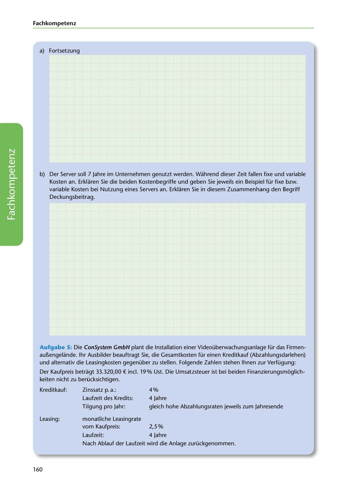

---
## Page 162
---

### Fach kom petenz

a) Fortsetzung

b) Der Server soll 7 Jahre im Unternehmen genutzt werden. Wahrend dieser Zeit fallen fixe und variable

Kosten an. Erklaren Sie die beiden Kostenbegriffe und geben Sie jeweils ein Beispiel für fixe bzw. variable Kosten bei Nutzung eines Servers an. Erklaren Sie in diesem Zusammenhang den Begriff Deckungsbeitrag.

<!-- IMAGE: page-162-img-1.jpeg - TODO: Add description -->

Aufgabe 5: Die ConSystem GmbH plant die lnstallation einer Videoüberwachungsanlage für das Firmen- aur..engelande. 1hr Ausbilder beauftragt Sie, die Gesamtkosten für einen Kreditkauf (Abzahlungsdarlehen) und alternativ die Leasingkosten gegenüber zu stellen. Folgende Zahlen stehen lhnen zur Verfügung:

Der Kaufpreis betragt 33.320,00 € incl. 19% Ust. Die Umsatzsteuer ist bei beiden Finanzierungsmoglich- keiten nicht zu berücksichtigen.

Kreditkauf: Zi nssatz p. a.: 4 % Laufzeit des Kredits: 4 Jahre Tilgung pro Jahr: gleich hohe Abzahlungsraten jeweils zum Jahresende

Leasing: monatliche Leasingrate vom Kaufpreis: 2,5 %

Laufzeit: 4 Jahre Nach Ablauf der Laufzeit wird die Anlage zurückgenommen.

160
