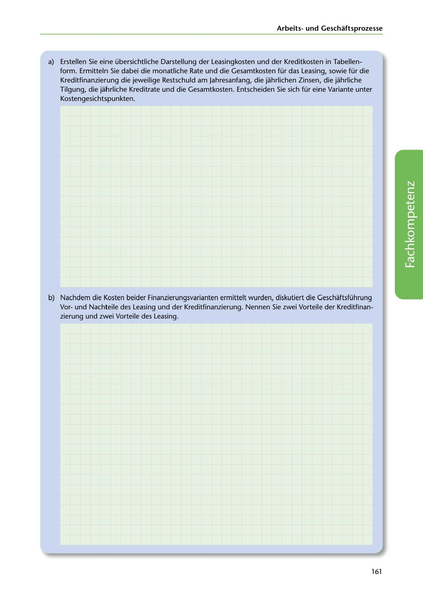

---
## Page 163
---

### Arbeitsund Geschaftsprozesse

a) Erstellen Sie eine übersichtliche Darstellung der Leasingkosten und der Kreditkosten in Tabellen-

form. Ermitteln Sie dabei die monatliche Rate und die Gesamtkosten für das Leasing, sowie für die Kreditfinanzierung die jeweilige Restschuld am Jahresanfang, die jahrlichen Zinsen, die jahrliche Tilgung, die jahrliche Kreditrate und die Gesamtkosten. Entscheiden Sie sich für eine Variante unter

Kostengesichtspunkten.

<!-- IMAGE: page-163-img-1.jpeg - TODO: Add description -->

b) Nachdem die Kosten beider Finanzierungsvarianten ermittelt wurden, diskutiert die Geschaftsführung Vorund Nachteile des Leasing und der Kreditfinanzierung. Nennen Sie zwei Vorteile der Kreditfinan- zierung und zwei Vorteile des Leasing.

161
